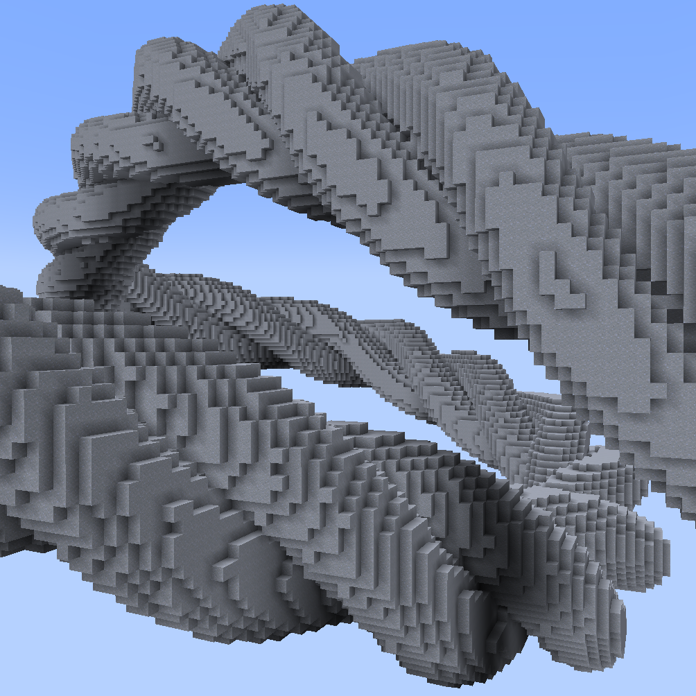
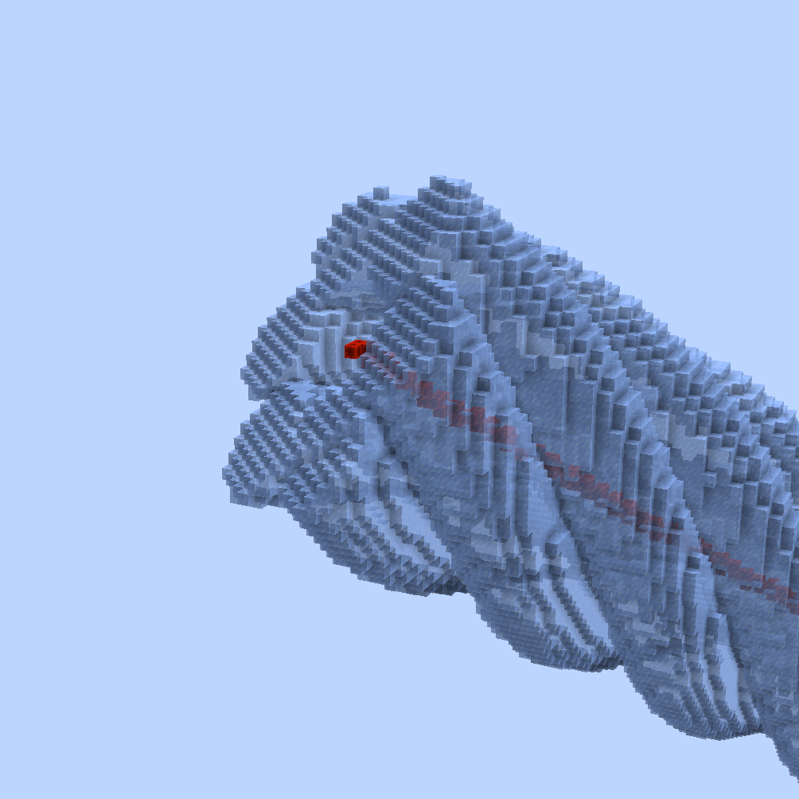
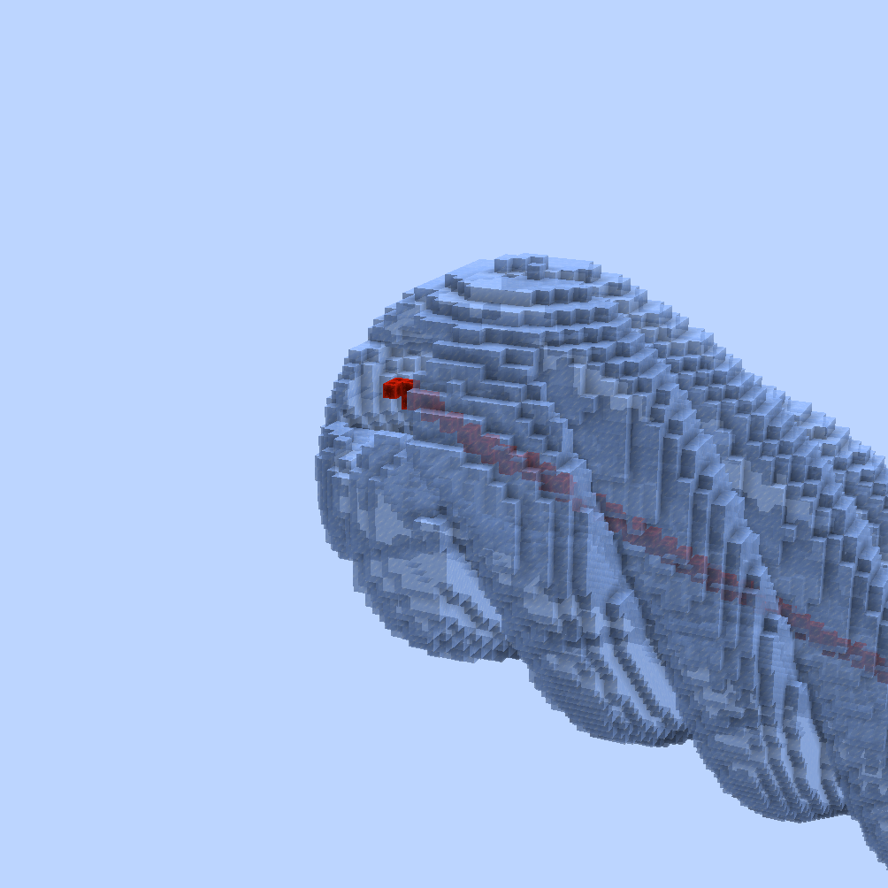
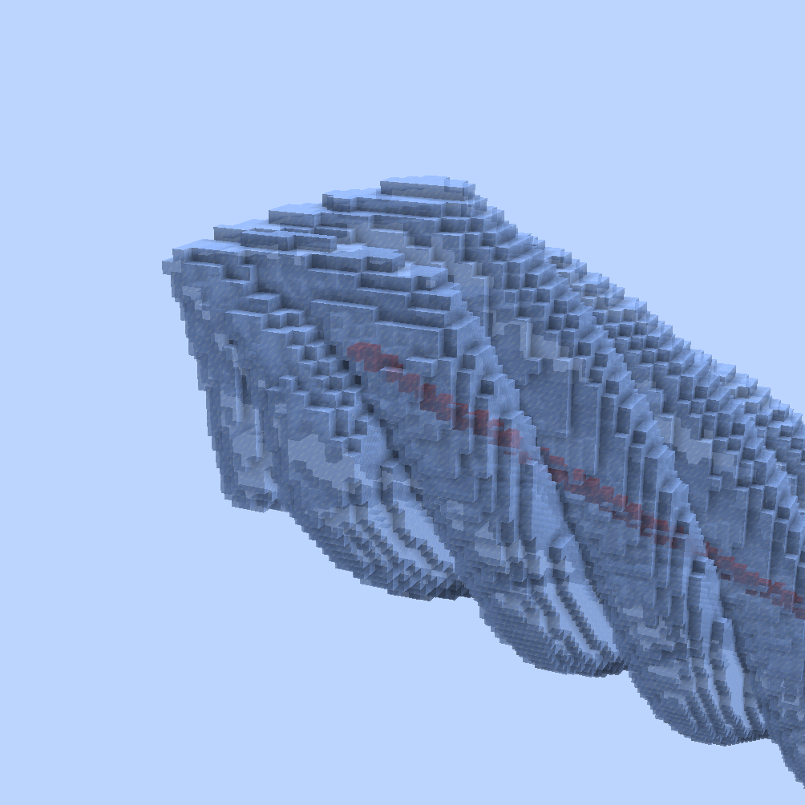
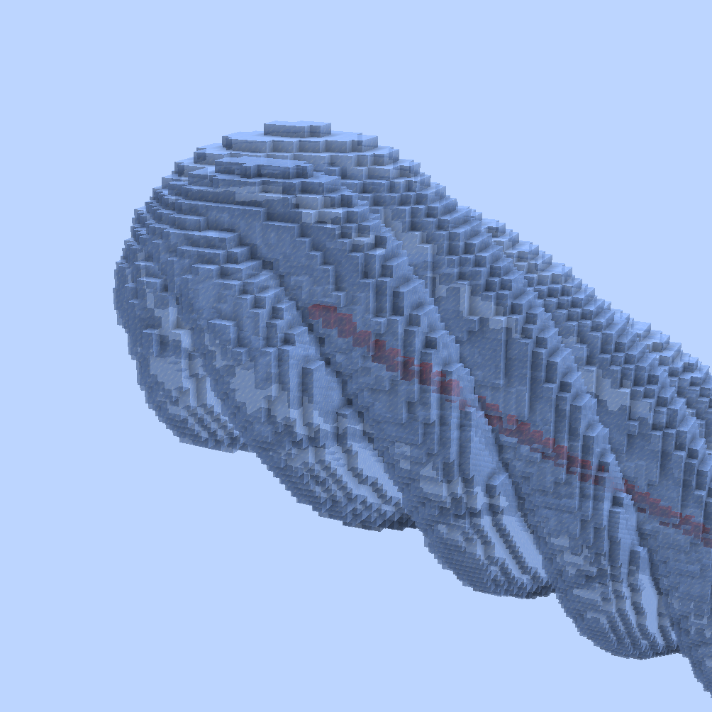
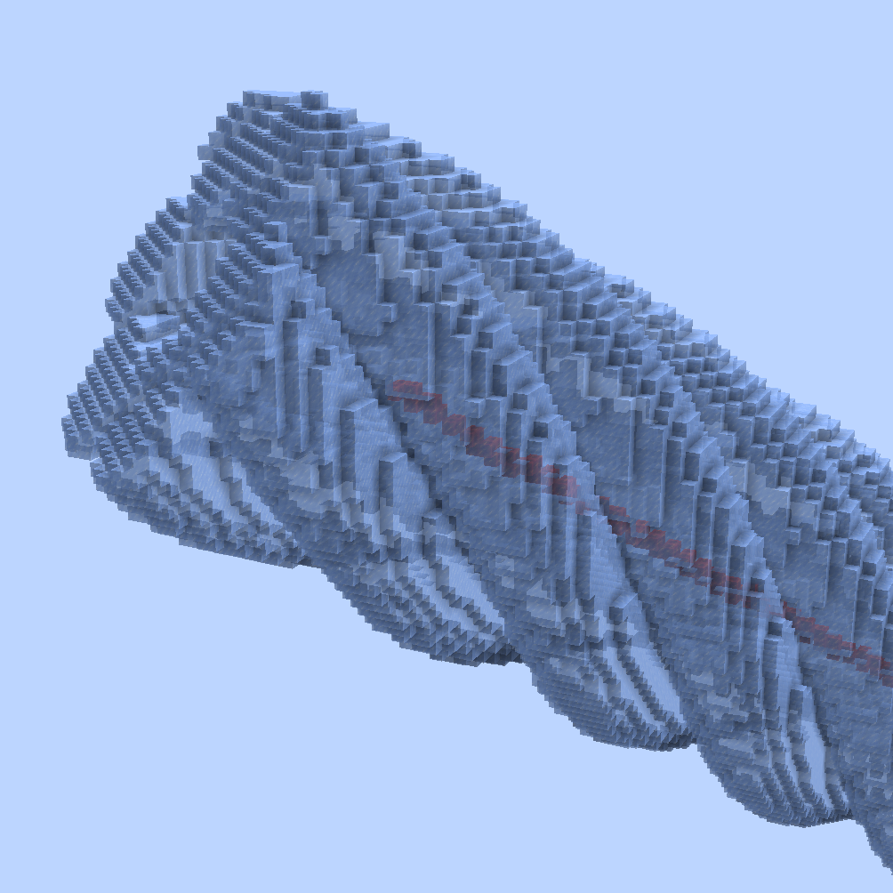
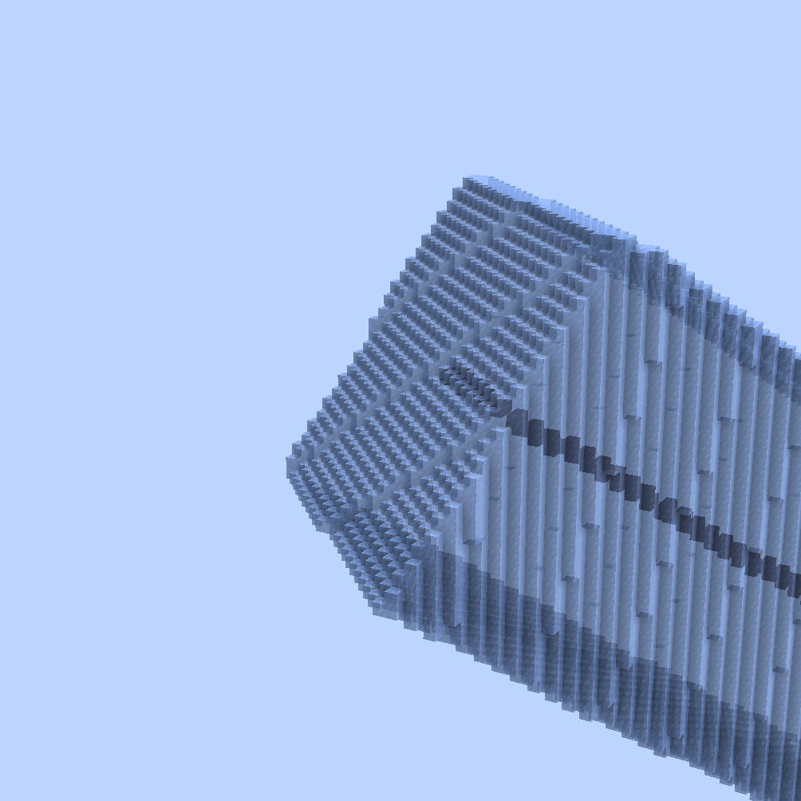
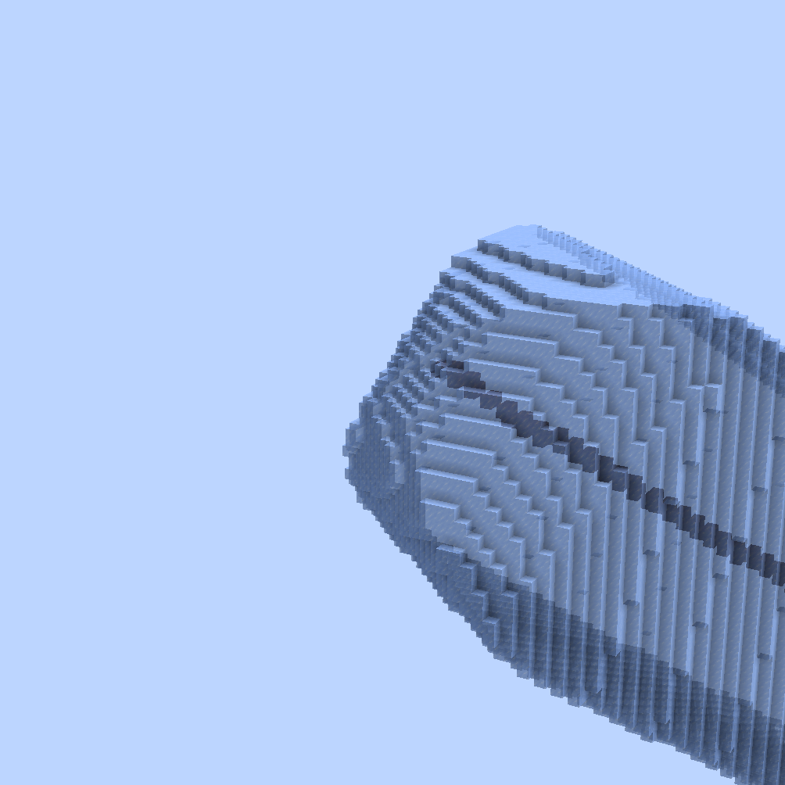
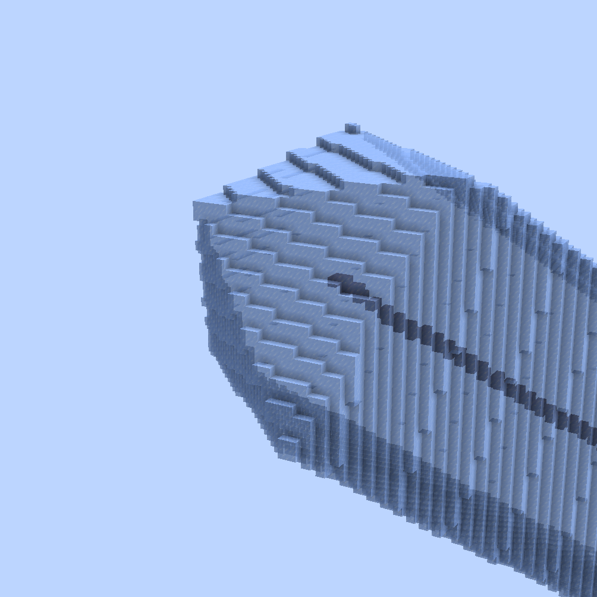
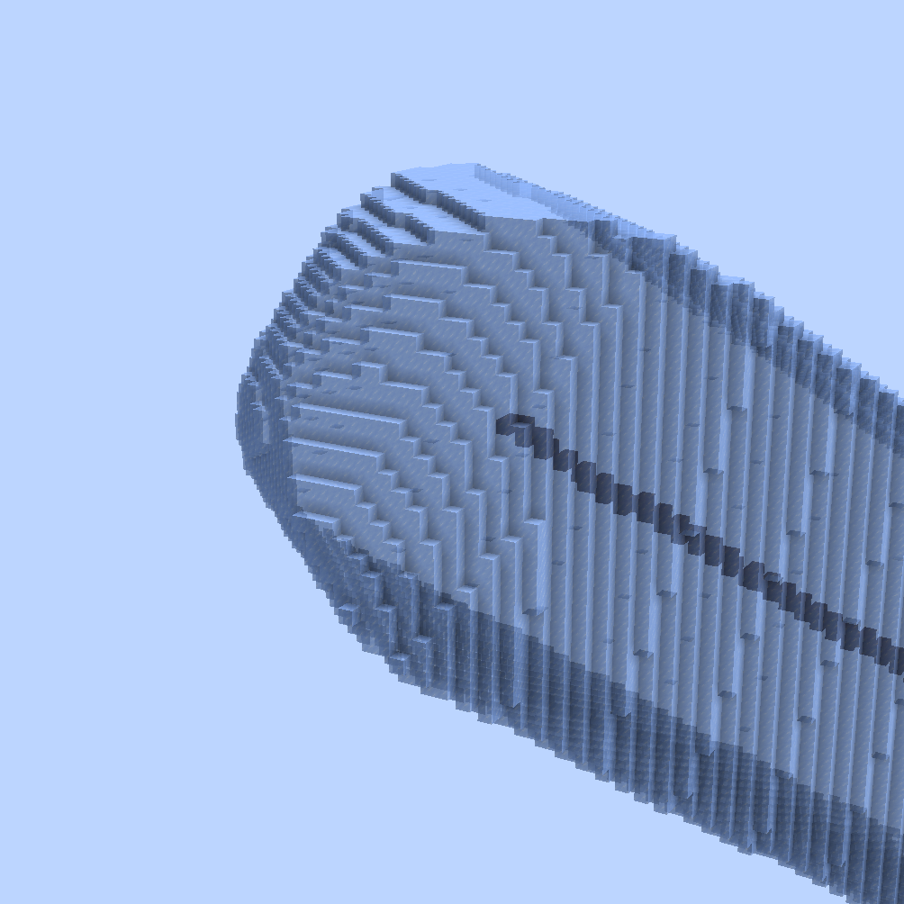

# Common Parameters

The following parameters and flags are available for **all** `//ezspline` subcommands.

***

### Radius progression: <mark style="color:orange;">`<radii>`</mark> 

Defines the thickness (course) of the spline.

**Acceptable values are:** one or more comma-separated entries, where each entry is either:

1. A **radius value** (e.g., `10`, `6.9`). Radius values must be greater than 0.
2. A **position and radius**, separated by a colon, where the position is a decimal between 0 and 1 (e.g., `0:10`, `0.5:15.5`).

Whereby if specified, each _position_ must be strictly ascending, and the first and last entries must be positions of `0` and `1`. If positions are omitted, they will be set and interpolated automatically.

For example

* `0.5:10`_`,`_`2` is illegal because the _first_ entry, which is always position `0.0`, has been specified as position "`0.5`"
* `5`_`,`_`0.6:10`_`,`_`15`_`,`_`0.4:20`_`,`_`5` is illegal because the positions are not in strictly ascending order since 0.4 came after 0.6.

<mark style="color:blue;">Examples</mark>

`//ezsp rope clay`` `**`<radii>`**

Single radius entry: GIF going from `//ezsp rope clay`` `**`5`** through up to `//ezsp rope clay`` `**`10`** :

Two radii entries: `//ezsp rope clay`` `**`1,12`** . The spline starts with radius 1 and progressively gets thicker up to radius 12 at the end:

Triple radii entries: `//ezsp rope clay`` `**`1,12,1`**. The spline starts with radius 1, and progressively gets larger up until the middle of the spline (50% of the path) where it reaches 12 and goes back to radius 1 towards the end:

As the first and last values always define the start- and end-radius of the spline and as all unspecified positions in between are interpolated, that means `1,12,1` (no positions specified) is expanded to **`0`**`:1,`**`0.5`**`:12,`**`1`**`:1` when you execute the command. You may also specify the positions yourself though.

Using the command `//ezsp rope clay`` `**`1,0.1:12,1`**, and going from `1,`**`0.1`**`:12,1` up through `1,`**`0.9`**`:12,1`. This shifts the "keyframe position" of our radius-12-entry throughout the spline (start and end are still fixed at radius 1):

Many radii entries: `//ezsp rope clay 2,10,2,12,2,10,2`. You may define any number of entries and their respective positions:

***

### Kochanek-Bartels-Parameters: <mark style="color:orange;">`-p <kbParameters>`</mark> 

Parameters for the flow of the spline. Determines what path the spline takes through the given node positions.

Defaults to `0:0:0`.

Provide `<tension>:<bias>:<continuity>`, colon-separated in that order. The expected value range for each parameter is `[-1..1]`.


[This diagram](https://en.wikipedia.org/wiki/Kochanek%E2%80%93Bartels_spline#/media/File:Kochanek_bartels_spline.svg) shows what each parameter does.

(Note: the order in the diagram (c,t,b) is different than what ezspline expects (t,b,c).)


<mark style="color:blue;">Examples:</mark>

`//ezsp polygon clay 10 4`` `**`-p <kbParameters>`**

**`-p 0:0:0`**

**`-p 0:-1:0`**

**`-p -1:0:0`**

**`-p 0:1:0`**

***

### Quality: <mark style="color:orange;">`-q <quality>`</mark> (v0.13.0 or newer) 

Determines how accurately the spline shape should be generated, trading between accuracy and runtime.

There are three modes:

1. <mark style="color:orange;">`FAST`</mark> (\~1.5x faster than balanced)
2. <mark style="color:orange;">`BALANCED`</mark>
3. <mark style="color:orange;">`EXACT`</mark> (\~3x slower than balanced)

Defaults to <mark style="color:orange;">`BALANCED`</mark> (which produces an almost perfect result relatively quickly).

<mark style="color:blue;">Examples (for v0.13.0 or newer)</mark>

`//ezspline rope clay 10`` `**`-q <quality>`**

`-q BALANCED`\

`-q FAST`\

***

### Quality: <mark style="color:orange;">`-q <quality>`</mark> (v0.12.0 or lower) 


v0.13.0 introduced a significantly better and faster spline algorithm. This is only relevant for people who still use ezEdits version 0.12.0 or older. See [above](common-parameters.md#quality) for newer version behaviour.


Sets the number of samples of the shape per dimension per block. Must be greater than 0.

Defaults to `2.0` (which produces a mediocre result relatively quickly).

If you get air gaps, or a noise-y / unsmoothed appearance, set the quality to a higher value, e.g. `-q 5.0`.


Higher values for the `-q` parameter can significantly increase processing time. While small values (e.g., `-q 2`) are relatively quick, larger values (e.g., `-q 10`) may take minutes. Additionally, the benefit of increasing the `-q` value diminishes beyond a certain point. We suggest using 2 while testing parameters and rendering with 4-6 for the final placement.


<mark style="color:blue;">Examples (for v0.12.0 or older)</mark>

`//ezspline beads clay 10`` `**`-q <quality>`**

GIF start at `-q 1` and moves up to `-q 7`.

For this example, `-q 2` took less than a second, and `-q 7` took 20 seconds to run.

***

### Initial roll: <mark style="color:orange;">`-r <startRoll>`</mark> or <mark style="color:orange;">`-r <startRoll>,<endRoll>`</mark> 

Allows to rotate the spline shape around the spline's axis, aka. rolling it. Expecting an angle given in degrees.

Defaults to `0`.

There are two ways to twist/roll your spline:

* You may define a starting roll angle with `-r` and a twisting angle with `-t`, allowing for a constant twist per length.
* Or may define a starting roll angle and an end roll angle by passing two comma-separated angles to `-r`. If you do that, `-t` will be ignored.

<mark style="color:blue;">Example</mark>

`//ezspline 2d Re(Y1:-0.2,Y2:0.2) clay 10`` `**`-r <angle>`**

GIF start at `-q 0` and moves up to `-q 180`.

***

### Stretch: <mark style="color:orange;">`-s <stretchFactor>`</mark> 

Allows stretching or compressing the spline shape in the direction of the spline path.

Defaults to `1`.


Note: `//ezspline structure`'s and `//ezspline expressions`'s `-z` flag overrides this flag. If `-z` is on, then `-s` does nothing.


<mark style="color:blue;">Example:</mark>

`//ezsp 3d Chainlink clay 10`` `**`-s <stretchFactor>`**

GIF starts at `-s 0.2`, briefly pauses at `-s 1`, and increases up to `-s 4`.

***

### Twist: <mark style="color:orange;">`-t <angle>`</mark> 

Defines how much to twist the shape along the spline. The input is an angle given in degrees.

Defaults to `0`. (Except for `//ezsp rope`, there it's 90)

Specifics: The angle determines how much the shape is rotated throughout the length of the current diameter of the spline. Meaning, that if the diameter is 30 blocks, then after 30 blocks of path length, the shape will have rotated by the given angle.

This parameter is ignored if you pass both a starting and an end angle to `-r`.

<mark style="color:blue;">Example:</mark>

`//ezsp 2d Polygon(S:4) clay 10`` `**`-t <angle>`**

GIF starts at `-t 0` and increases up to `-t 90`.

***

### Normal Mode: <mark style="color:orange;">`-n <normalMode>`</mark> 

There are three modes:

1. <mark style="color:orange;">`CONSISTENT`</mark> aims to appear smooth and consistent by "rolling" the spline shape in curves.
2. <mark style="color:orange;">`HORIZONTAL`</mark> prevents the spline shape from "rolling sideways", keeping its initial orientation.
3. <mark style="color:orange;">`UPRIGHT`</mark> makes the internal spline shape's y-axis with the world's y-axis.

The default is <mark style="color:orange;">`CONSISTENT`</mark>.

<mark style="color:blue;">Examples:</mark>

`//ezspline expression black,red,blue,white,yellow 5 -o`` `**`-n <normalMode>`**` ``((z%2)>1.5?5:2*(x>0)+(y>0))+0.001`

`-n CONSISTENT`: The default value. The spline curves around the path in a smooth fashion. Towards the end, a noticeable amount of rolling has accumulated since. (At the start white+red is the top surface, while towards the end white+blue is at the top -> the spline "rolled").

`-n HORIZONTAL`: The spline tries to align the originally upwards-facing surface to remain upwards, preventing itself from "rolling sideways". You can see that by the fact the white+red face is facing upwards throughout the entire spline.

`-n UPRIGHT`: The internal y-axis is always aligned with the world's y-axis instead of being perpendicular to the path. Notice how the yellow stripes are not perpendicular but perfectly vertical now.

**Another more dramatic example (same command, different path):**

`-n CONSISTENT`

`-n HORIZONTAL`: Spline is forced to twist itself at steep/vertical sections to remain horizontal. (Here, it always tries to put the white+red surface at the top).

`-n UPRIGHT`: As you'd expect, when the spline's y-axis is perfectly vertical, then it does not like steep/vertical path sections...

***

### End Style: <mark style="color:orange;">`-e <endMode>`</mark> 

Set how the two ends of the spline should look like.

There are five modes:

1. <mark style="color:orange;">`FLAT`</mark> The spline ends abruptly at the exact endpoint of the path.
2. <mark style="color:orange;">`SOFT`</mark> The spline ends softly shape Cuts into the spline, tapering off the end in a softened end.
3. <mark style="color:orange;">`SPIKE`</mark> The spline ends with a cone that extends beyond the endpoint of the path.
4. <mark style="color:orange;">`ROUND`</mark> The spline ends with a dome that extends beyond the endpoint of the path.
5. <mark style="color:orange;">`CUBE`</mark> The spline ends in a cube shape beyond the endpoint of the path.

The default is <mark style="color:orange;">`FLAT`</mark>.

<mark style="color:blue;">Example</mark>

`//ezsp rope ice 15 6`` `**`-e <endMode>`**

`-e FLAT`\

`-e SOFT`\
\\

`-e SPIKE`\
\\

`-e ROUND`\
\\

`-e CUBE`\

The redstone block line shows the used convex selection.

`//ezsp 2d square ice 15`` `**`-e <endMode>`**

`-e FLAT`\

`-e SOFT`\

`-e SPIKE`\

`-e ROUND`\

`-e CUBE`\

***

### Ingame help page: <mark style="color:orange;">`-h`</mark> 

Prints the in-game help page. Shortcut for `//help ezspline ...`

***
