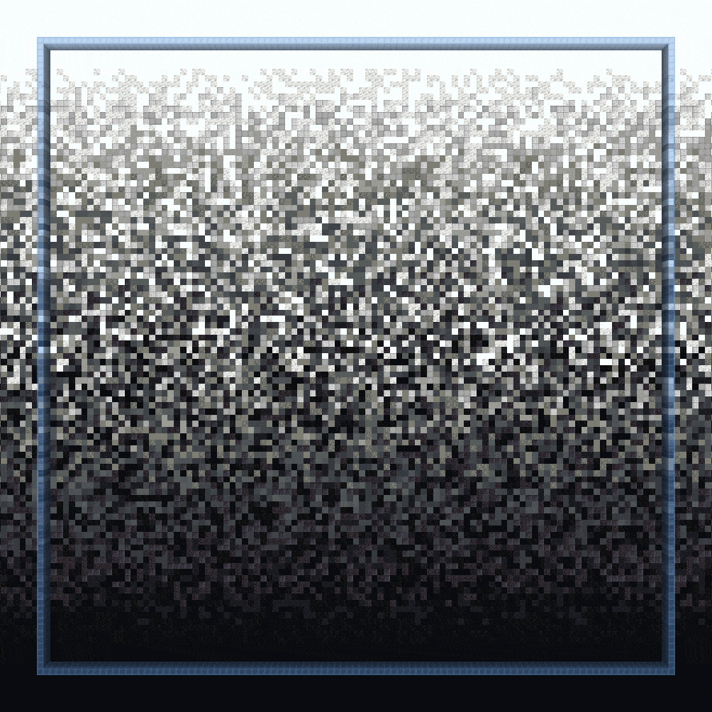
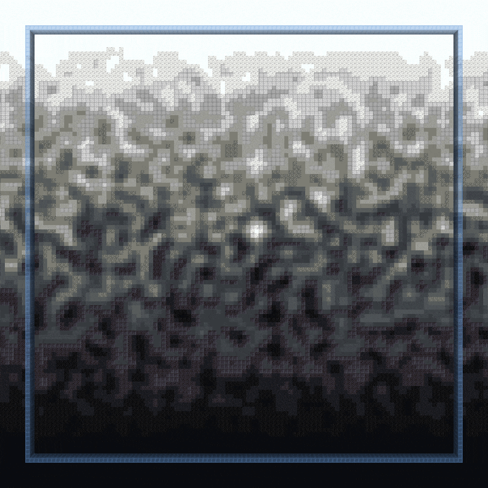
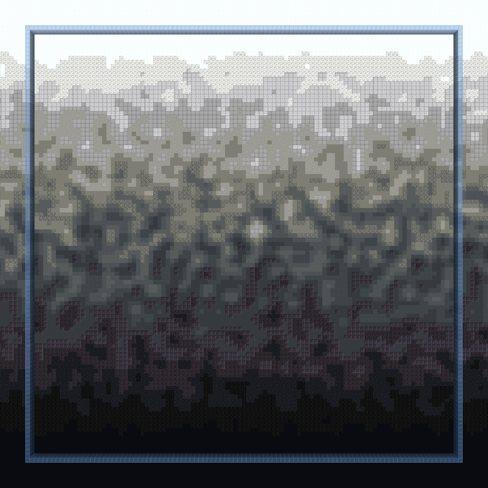
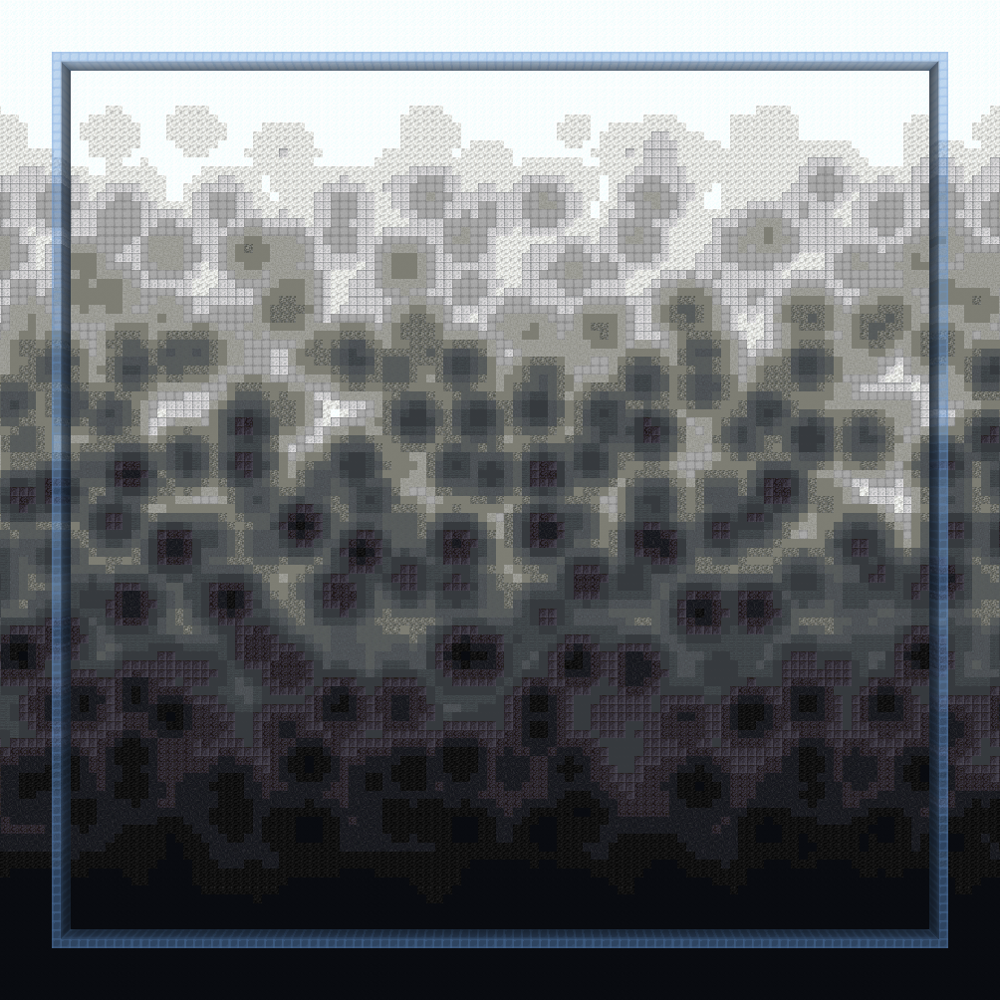
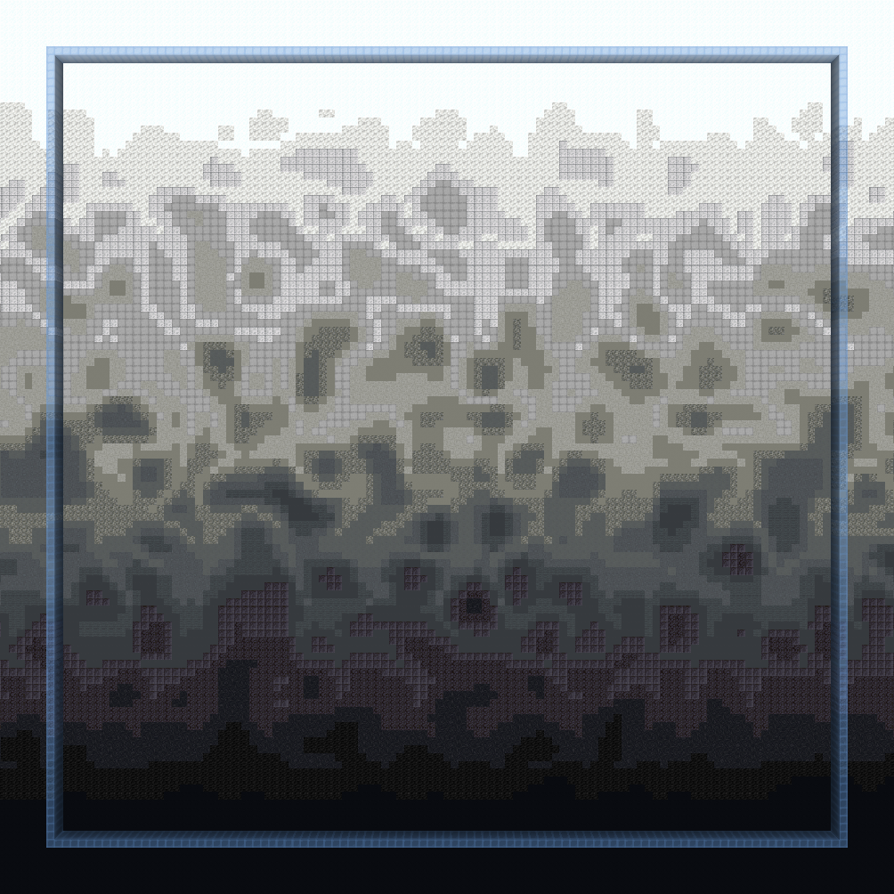
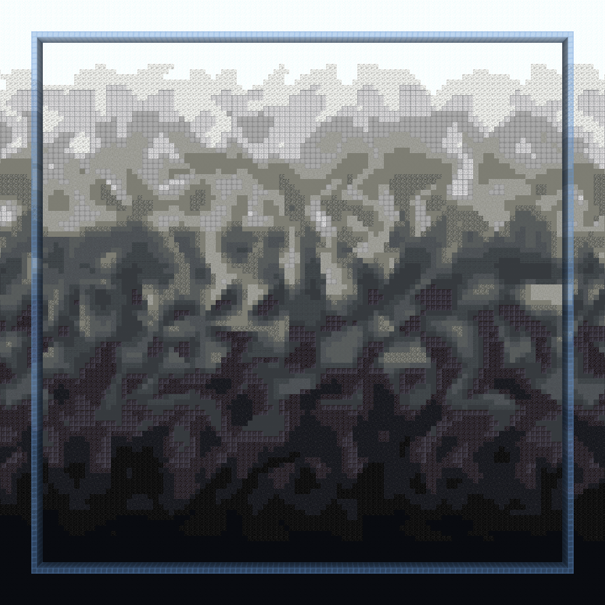
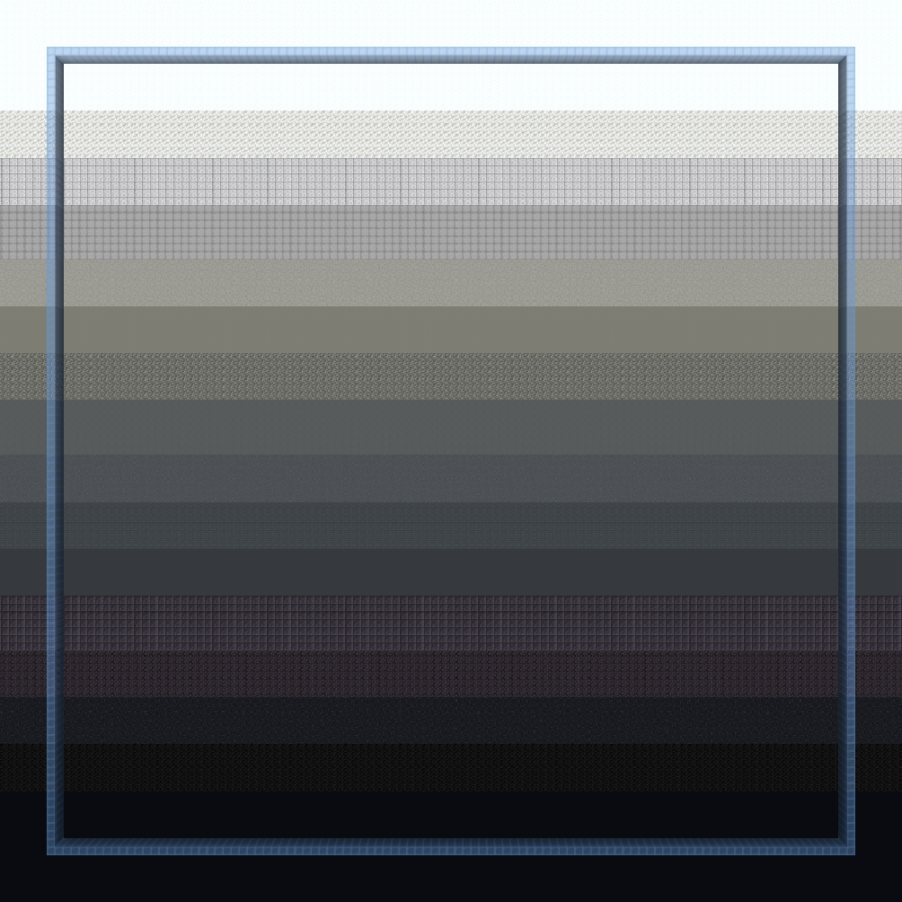
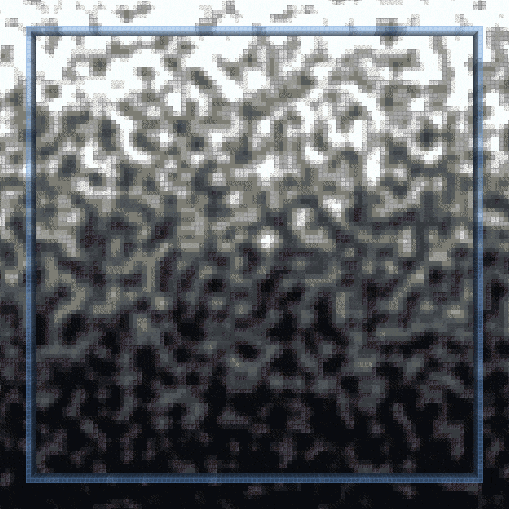
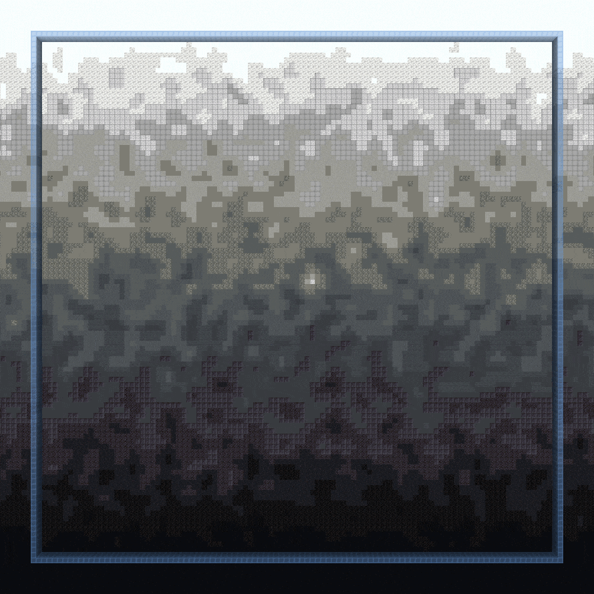
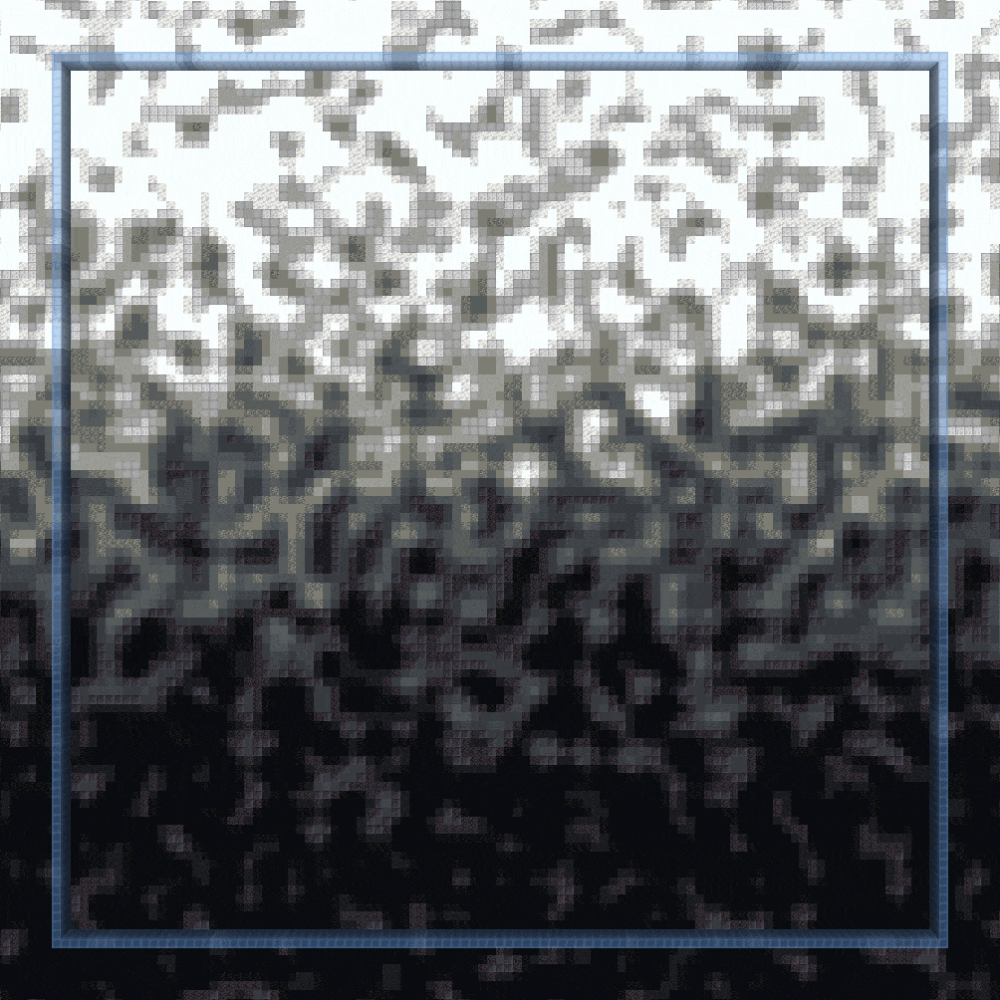

<!--
CO_OP_TRANSLATOR_METADATA:
{
  "original_hash": "2836dae91caf7ba17bb4a44767d496ad",
  "translation_date": "2025-05-13T02:28:14+00:00",
  "source_file": "brushes-and-tools/brushes/palette-gradient-brushes.md",
  "language_code": "tw"
}
-->
# Palette 漸層畫筆

以下指令包含用於創建漸層的畫筆。

***

### `//ezbr `<mark style="color:orange;">`gradient`</mark>

<mark style="color:blue;">漸層畫筆</mark>

**`//ezbr gradient `**<mark style="color:orange;">**`<palette> [radius] [interpolation] [bleed] [-av] [-n <noise>] [-z <scale>] [-d <distanceFunction>]`**</mark>

`gradient` 畫筆讓你先選擇兩個點定義一個平面，接著可以根據在此平面上的距離，使用選定的方塊來繪製漸層。

<mark style="color:blue;">**左鍵點擊**</mark>** 在目標方塊開始定義平面**\
<mark style="color:blue;">**潛行 + 左鍵點擊**</mark>** 在玩家位置開始定義平面**\
<mark style="color:blue;">**右鍵點擊**</mark>** 在目標方塊設定平面終點，或在平面設定完成後繪製調色盤方塊**\
<mark style="color:blue;">**潛行 + 右鍵點擊**</mark>** 在玩家位置設定平面終點，或在平面設定完成後繪製調色盤方塊**\
<mark style="color:blue;">**切換手持物**</mark>**（預設 F 鍵）在全局和每件物品的漸層間切換**

* <mark style="color:orange;">**Palette**</mark>：指定用於漸層的調色盤。
* <mark style="color:orange;">**Radius**</mark>（預設：8）：設定畫筆半徑。
* <mark style="color:orange;">**Interpolation**</mark>（預設：NONE）：決定漸層過渡時使用的插值類型。
* <mark style="color:orange;">**Bleed**</mark>（預設：0.5）：調整插值強度，正常範圍為0到1。
* <mark style="color:orange;">**`-a`**</mark>：啟用後，漸層可替換空氣方塊。
* <mark style="color:orange;">**`-v`**</mark>：停用 WorldEditCUI 整合。
* <mark style="color:orange;">**`-n <noise>`**</mark>（預設：`White()`）：為漸層效果增加底層噪音場。
* <mark style="color:orange;">**`-z <scale>`**</mark>（預設：1）：調整噪音的比例。
* <mark style="color:orange;">**`-d <distanceFunction>`**</mark>（預設：NONE）：設定距離模式，讓畫筆根據初始方塊距離及指定距離函數運作。

***

### `//ezbr `<mark style="color:orange;">`gradientstroke`</mark>

<mark style="color:blue;">漸層筆劃畫筆</mark>

**`//ezbr gradientstroke `**<mark style="color:orange;">**`<palette> [radius] [interpolation] [bleed] [-advw] [-n <noise>] [-z <scale>]`**</mark>

`gradientstroke` 畫筆可讓你沿著由多個點定義的路徑（筆劃）應用漸層。

<mark style="color:blue;">**左鍵點擊**</mark>** 新增點**\
<mark style="color:blue;">**潛行 + 左鍵點擊**</mark>** 移除最後一個點**\
<mark style="color:blue;">**右鍵點擊**</mark>** 確認並放置漸層筆劃**\
<mark style="color:blue;">**潛行 + 右鍵點擊**</mark>** 清除所有點**\
<mark style="color:blue;">**切換手持物**</mark>**（預設 F 鍵）在全局和每件物品的漸層間切換**

* <mark style="color:orange;">**Palette**</mark>：指定漸層的方塊樣式。
* <mark style="color:orange;">**Radius**</mark>（預設：8）：設定畫筆半徑。
* <mark style="color:orange;">**Interpolation**</mark>（預設：LINEAR）：決定漸層過渡時使用的插值類型。
* <mark style="color:orange;">**Bleed**</mark>（預設：0.5）：調整插值強度，正常範圍為0到1。
* <mark style="color:orange;">**`-a`**</mark>：啟用後，漸層可替換空氣方塊。
* <mark style="color:orange;">**`-d`**</mark>：啟用「距離中心」模式，漸層根據距離筆劃線中點計算，而非沿筆劃距離。
* <mark style="color:orange;">**`-v`**</mark>：停用 WorldEditCUI 整合。
* <mark style="color:orange;">**`-w`**</mark>：每次放置筆劃後清除畫筆路徑。
* <mark style="color:orange;">**`-n <noise>`**</mark>（預設：`White()`）：為漸層效果增加底層噪音場。
* <mark style="color:orange;">**`-z <scale>`**</mark>（預設：1）：調整噪音的比例。

***

## 漸層參數

有幾個漸層相關的參數值得說明。

### Bleed

首先是 <mark style="color:orange;">**`bleed`**</mark> 參數。

Bleed 參數決定顏色彼此滲透的程度。

### Noise

這種滲透的模式可以由 <mark style="color:orange;">**`noise`**</mark> 來決定。上方的 GIF 使用白噪音 (`-n White`)，接下來的 GIF 則使用柏林噪音 (`-n Perlin(Freq:0.25)`)

#### 你也可以使用任何噪音。以下是幾個範例：

**`-n Perlin(Freq:0.25)`**

**`-n Cellular(Freq:0.15)`**

**`-n @@ridged(Freq:0.15)`**

**`-n Shard(Freq:0.15)`**

### 插值模式

以下比較五種不同的 <mark style="color:orange;">**`interpolation modes`**</mark>，它們如何將噪音應用到漸層。GIF 會展示在0到1間不斷增加和減少的 bleed 值。

_藍色方塊的上下端顯示漸層的起點和終點_

#### NONE

不使用任何插值。

#### LINEAR

噪音在整個漸層中以固定比例應用，因此漸層會在我們選擇的兩個位置之外「裁切」。

#### TAPERED

噪音在漸層中間最強，向起點和終點逐漸減弱，避免在指定位置外「裁切」。

#### BEZIER

使用貝茲插值，使噪音應用更柔和順暢。當 bleed 值大於1時會中斷。

#### SIN

