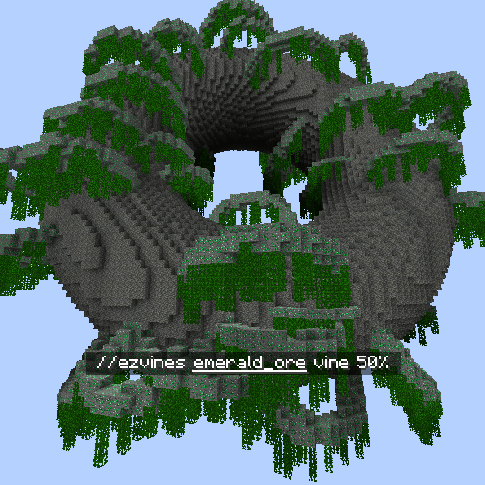
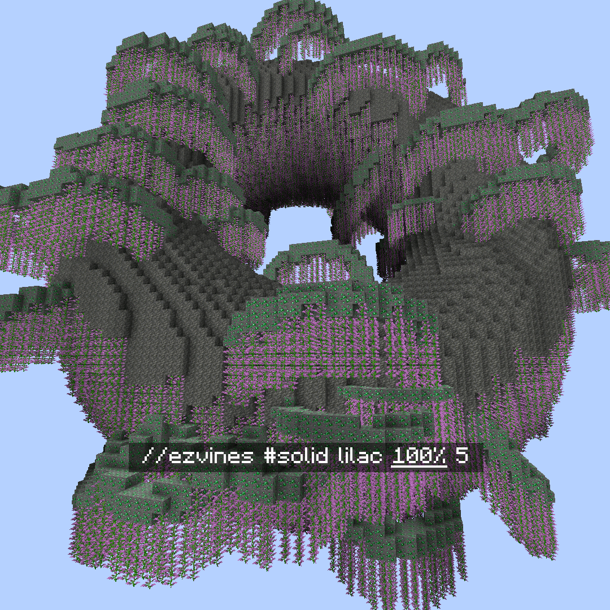

<!--
CO_OP_TRANSLATOR_METADATA:
{
  "original_hash": "10e418effc59bbdf88ef69673be1b313",
  "translation_date": "2025-05-13T02:22:46+00:00",
  "source_file": "commands/region.md",
  "language_code": "tw"
}
-->
# Region

一組在你選擇的區域內操作的各種指令集合。

### `//ezvines`

Vines

**`//ezvines <mask> <pattern> [percentage] [min_length] [max_length]`**

**`Alias: //vines`**

* **Mask**：指定用來掛「藤蔓」的區塊遮罩。  
* **Pattern**：決定要放置的區塊樣式。  
* **Percentage**（預設值：10%）：設定要掛藤蔓的區塊比例。  
* **Min Length**（預設值：2）：指定藤蔓的最短長度。  
* **Max Length**（預設值：5）：定義藤蔓的最長長度。

 **`<mask>`**

 **`[percentage]`**

 **`[min_length] [max_length]`**

### `//ezmoss`

Moss

**`//ezmoss <pattern> [amount] [smooth_radii] [smooth_iterations]`**

**`Alias: //moss`**

* **Pattern**：決定苔蘚要使用的區塊樣式。  
* **Amount**（預設值：2.0）：指定要放置的苔蘚量。可使用小數，數值較為隨意。  
* **Smooth Radii**（預設值：1）：設定苔蘚放置的平滑半徑。可以是一個半徑，或是以逗號分隔的三個半徑，順序為東/西、上下、南/北。  
* **Smooth Iterations**（預設值：5）：定義要進行的平滑次數。

 **`[amount]`**

 **`[smooth_radii]`**

 **`[smooth_radii]`**

 **`[smooth_iterations]`**

### `//ezslabmerge`

SlabMerge

**`//ezslabmerge <mask> [-b] [-t]`**

**`Alias: //slabmerge`**

* **Mask**：指定用來選擇區域內受影響區塊的遮罩。  
* **-b**：使用時，底部半磚也會轉換成完整方塊。  
* **-t**：使用時，頂部半磚也會轉換成完整方塊。

### `//ezstatecyle`

StateCycle

**`//ezstatecycle <mask> <state>`**

**`Alias: //statecycle`**

* **Mask**：指定用來選擇區域內受影響區塊的遮罩。  
* **State**：指定要在選取區塊中循環的區塊狀態值。

**免責聲明**：  
本文件係使用 AI 翻譯服務 [Co-op Translator](https://github.com/Azure/co-op-translator) 所翻譯。雖然我們力求準確，但請注意自動翻譯可能包含錯誤或不準確之處。原始文件的母語版本應視為權威來源。對於重要資訊，建議採用專業人工翻譯。本公司不對因使用本翻譯所引起之任何誤解或誤譯負責。