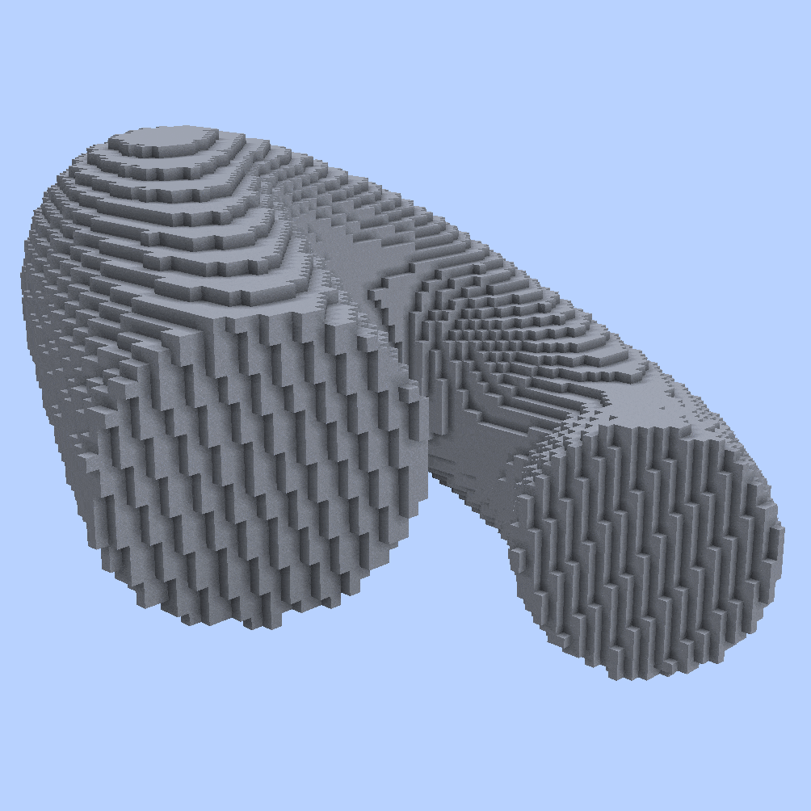
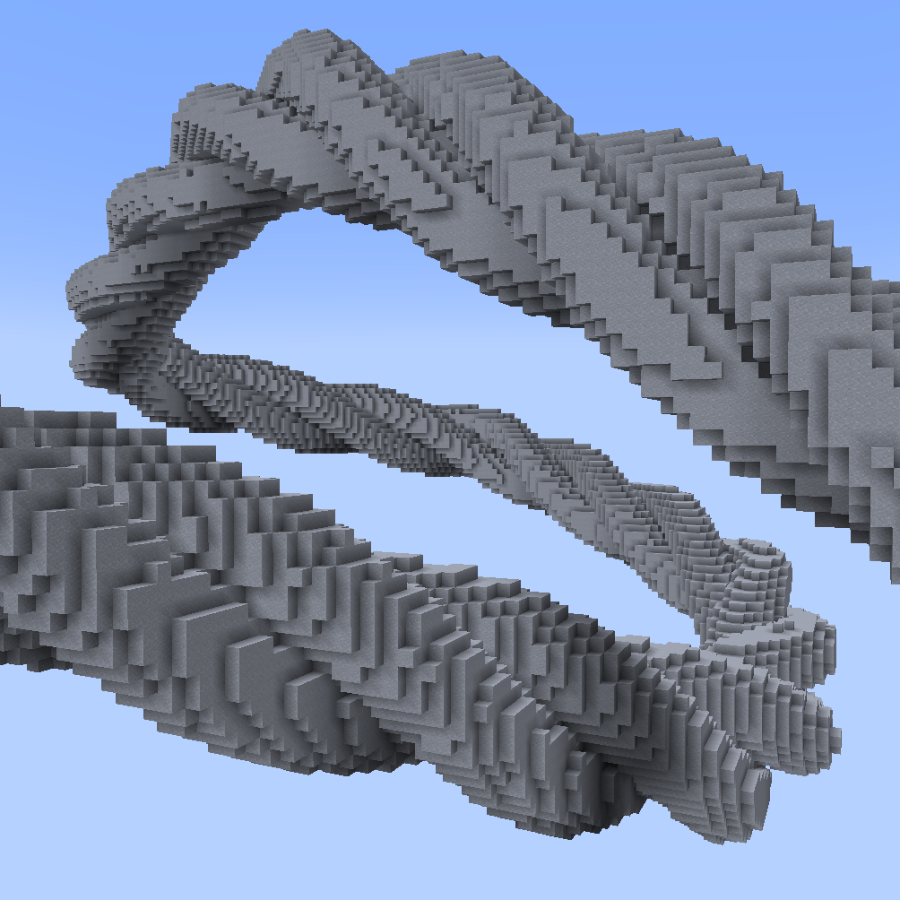
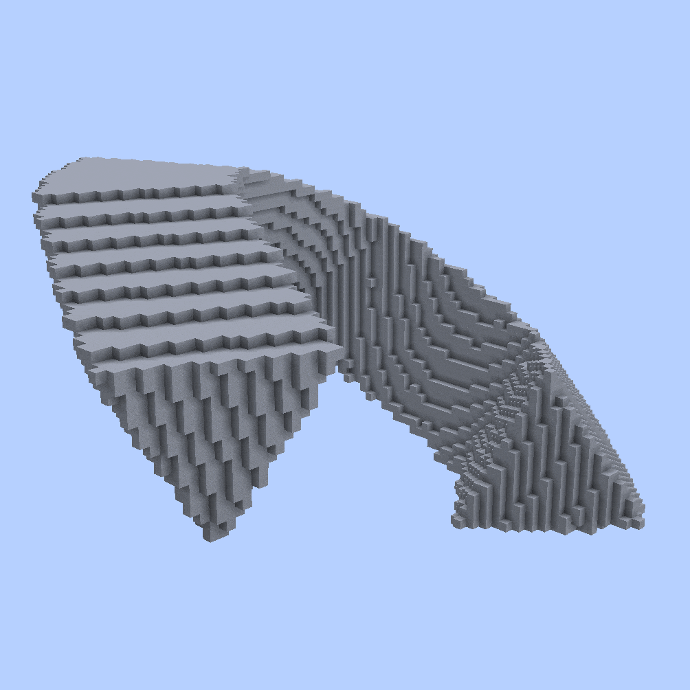
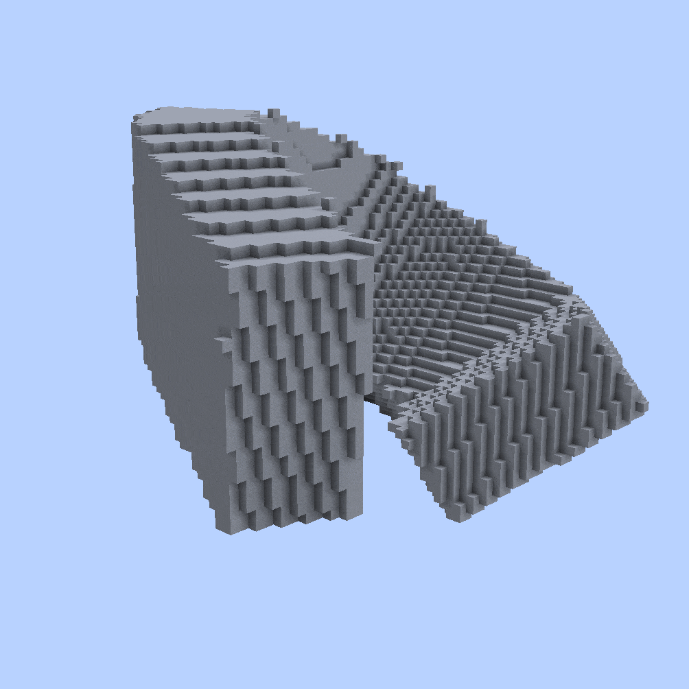
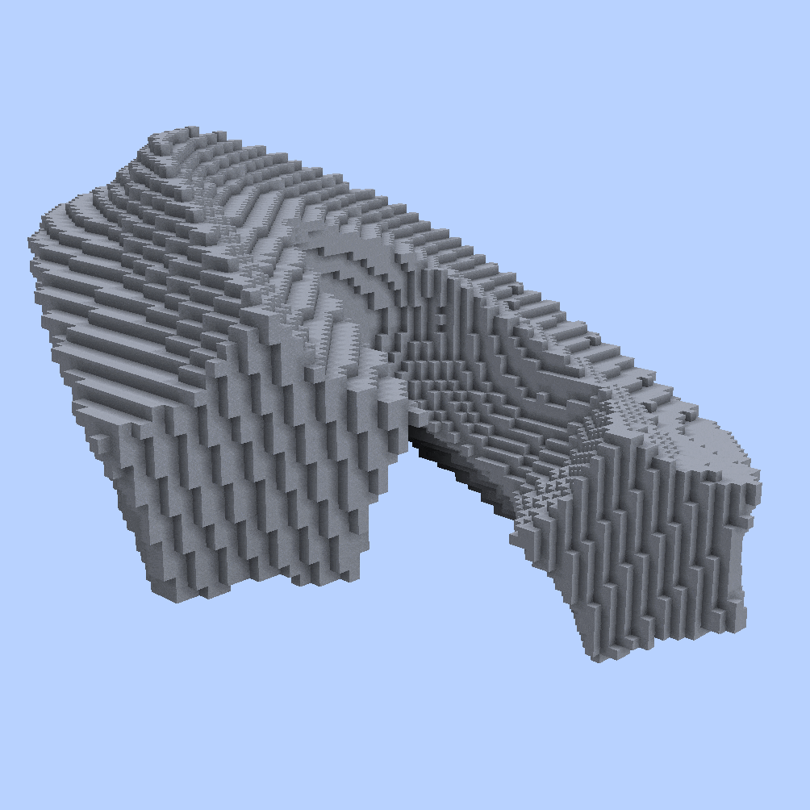

<!--
CO_OP_TRANSLATOR_METADATA:
{
  "original_hash": "bb555b3ff67d75c052068a23763d8dac",
  "translation_date": "2025-05-13T02:30:15+00:00",
  "source_file": "commands/spline/2d-spline-shapes.md",
  "language_code": "tw"
}
-->

**`//ezsp 2d CirclesCircle([`**<mark style="color:orange;">**`Count:<value>`**</mark>**`],[`**<mark style="color:orange;">**`Filled:<boolean>`**</mark>**`])`** [**`<pattern>`**](2d-spline-shapes.md#syntax) [**`<radii>`**](common-parameters.md#radii) [**`[-t <angle>]`**](common-parameters.md#twist) [**`[-p <kbParameters>]`**](common-parameters.md#kb-parameters) [**`[-q <quality>]`**](common-parameters.md#quality) [**`[-n <normalMode>]`**](common-parameters.md#normal-mode) [**`[-h]`**](common-parameters.md#help-page)

沿著樣條路徑生成多個並排的圓柱樣條。

* **`[`**<mark style="color:orange;">**`Count:<value>`**</mark>**`]`** (<mark style="color:orange;">**`C`**</mark>)（預設值：3）
  * 決定「圓中圓」裡有多少個圓。必須介於1到12之間。
* **`[`**<mark style="color:orange;">**`Filled:<boolean>`**</mark>**`]`** (<mark style="color:orange;">**`F`**</mark>)（預設值：false）
  * 決定裡面是否要填滿。

參考：[https://www.desmos.com/calculator/ht9tak6nri](https://www.desmos.com/calculator/ht9tak6nri)

範例：

`//ezsp 2d CC(`<mark style="color:orange;">`Count:`</mark><mark style="color:orange;">**`1`**</mark>`) clay 15`

下面的 GIF 是直接執行上述指令，並且每次遞增 <mark style="color:orange;">Count</mark> 參數，從 **1** 到 **10** 所產生的：

`//ezspline 2d CirclesCircle `<mark style="color:orange;">**`-t 90`**</mark>` clay 10`

下面的樣條可以用上述指令產生，簡單來說就是套用[twist 參數](common-parameters.md#twist)：

或者使用 `//ezspline rope clay 10`

<mark style="color:blue;">`//ezspline rope`</mark> 是 <mark style="color:orange;">`//ezspline 2d CirclesCircle`</mark><mark style="color:orange;">` `</mark><mark style="color:orange;">**`-t 90`**</mark> 的別名

***

#### 

### `//ezspline 2d `<mark style="color:orange;">`Polygon (Po)`</mark> 

<mark style="color:blue;">多邊形樣條</mark>

**`//ezsp 2d Polygon([`**<mark style="color:orange;">**`Sides:<value>`**</mark>**`])`** [**`<pattern>`**](2d-spline-shapes.md#syntax) [**`<radii>`**](common-parameters.md#radii) [**`[-t <angle>]`**](common-parameters.md#twist) [**`[-p <kbParameters>]`**](common-parameters.md#kb-parameters) [**`[-q <quality>]`**](common-parameters.md#quality) [**`[-n <normalMode>]`**](common-parameters.md#normal-mode) [**`[-h]`**](common-parameters.md#help-page)

沿著樣條路徑生成多邊形形狀的樣條。

* **`[`**<mark style="color:orange;">**`Sides:<value>`**</mark>**`]`** (<mark style="color:orange;">**`S`**</mark>)（預設值：5）：
  * 多邊形的邊數。3 是三角形，4 是正方形，5 是五邊形，依此類推。至少要 3 邊。
  * 參考：[https://www.desmos.com/calculator/eemibllcg8](https://www.desmos.com/calculator/eemibllcg8)

範例：

`//ezsp 2d Polygon(`<mark style="color:orange;">`Sides:`</mark><mark style="color:orange;">**`3`**</mark>`) clay 15`

這個 GIF 是執行上面指令，並且每次遞增 count 參數，從 3 到 8 所產生的：

***

#### 

### `//ezspline 2d `<mark style="color:orange;">`Rectangle (Re)`</mark> 

<mark style="color:blue;">矩形樣條</mark>

**`//ezsp 2d Rectangle([`**<mark style="color:orange;">**`X1:<value>`**</mark>**`],[`**<mark style="color:orange;">**`Y1:<value>`**</mark>**`],[`**<mark style="color:orange;">**`X2:<value>`**</mark>**`],[`**<mark style="color:orange;">**`Y2:<value>`**</mark>**`])`** [**`<pattern>`**](2d-spline-shapes.md#syntax) [**`<radii>`**](common-parameters.md#radii) [**`[-t <angle>]`**](common-parameters.md#twist) [**`[-p <kbParameters>]`**](common-parameters.md#kb-parameters) [**`[-q <quality>]`**](common-parameters.md#quality) [**`[-n <normalMode>]`**](common-parameters.md#normal-mode) [**`[-h]`**](common-parameters.md#help-page)

沿著樣條路徑生成矩形形狀的樣條。

* **`[`**<mark style="color:orange;">**`X1:<value>`**</mark>**`]`**（預設值：-1.0）：
  * 定義矩形第一個角落的 x 座標。範圍介於 -1 到 1。
* **`[`**<mark style="color:orange;">**`Y1:<value>`**</mark>**`]`**（預設值：-1.0）：
  * 定義矩形第一個角落的 y 座標。範圍介於 -1 到 1。
* **`[`**<mark style="color:orange;">**`X2:<value>`**</mark>**`]`**（預設值：1.0）：
  * 定義矩形第二個角落的 x 座標。範圍介於 -1 到 1。
* **`[`**<mark style="color:orange;">**`Y2:<value>`**</mark>**`]`**（預設值：1.0）：
  * 定義矩形第二個角落的 y 座標。範圍介於 -1 到 1。

(<mark style="color:red;">**`!`**</mark>) 我們提供了一個簡潔的互動圖表，您可以在上面調整矩形位置，並且看到對應的數值，反之亦然：[https://www.desmos.com/calculator/jqyaujpdsk](https://www.desmos.com/calculator/jqyaujpdsk)

範例：

* 上面「Hi」字樣是透過執行以下指令集產生的：
  * `//ezsp 2d `<mark style="color:orange;">`Re(x1:`</mark><mark style="color:orange;">**`-1.0`**</mark><mark style="color:orange;">`,y1:`</mark><mark style="color:orange;">**`-1.0`**</mark><mark style="color:orange;">`,x2:`</mark><mark style="color:orange;">**`-0.6`**</mark><mark style="color:orange;">`,y2:`</mark><mark style="color:orange;">**`1.0`**</mark><mark style="color:orange;">`)`</mark>` clay 12`
    * （H 字的左邊直線）
  * `//ezsp 2d `<mark style="color:orange;">`Re(x1:`</mark><mark style="color:orange;">**`-0.2`**</mark><mark style="color:orange;">`,y1:`</mark><mark style="color:orange;">**`-1.0`**</mark><mark style="color:orange;">`,x2:`</mark><mark style="color:orange;">**`0.2`**</mark><mark style="color:orange;">`,y2:`</mark><mark style="color:orange;">**`1.0`**</mark><mark style="color:orange;">`)`</mark>` clay 12`
    * （H 字的右邊直線）
  * `//ezsp 2d `<mark style="color:orange;">`Re(x1:`</mark><mark style="color:orange;">**`-1.0`**</mark><mark style="color:orange;">`,y1:`</mark><mark style="color:orange;">**`-0.2`**</mark><mark style="color:orange;">`,x2:`</mark><mark style="color:orange;">**`0.2`**</mark><mark style="color:orange;">`,y2:`</mark><mark style="color:orange;">**`0.2`**</mark><mark style="color:orange;">`)`</mark>` clay 12`
    * （H 字的橫線）
  * `//ezsp 2d `<mark style="color:orange;">`Re(x1:`</mark><mark style="color:orange;">**`0.6`**</mark><mark style="color:orange;">`,y1:`</mark><mark style="color:orange;">**`-1.0`**</mark><mark style="color:orange;">`,x2:`</mark><mark style="color:orange;">**`1.0`**</mark><mark style="color:orange;">`,y2:`</mark><mark style="color:orange;">**`0.2`**</mark><mark style="color:orange;">`)`</mark>` clay 12`
    * （i 字的直線）
  * `//ezsp 2d `<mark style="color:orange;">`Re(x1:`</mark><mark style="color:orange;">**`0.6`**</mark><mark style="color:orange;">`,y1:`</mark><mark style="color:orange;">**`0.6`**</mark><mark style="color:orange;">`,x2:`</mark><mark style="color:orange;">**`1.0`**</mark><mark style="color:orange;">`,y2:`</mark><mark style="color:orange;">**`1.0`**</mark><mark style="color:orange;">`)`</mark>` clay 12`
    * （i 字的點）

***

#### 

### `//ezspline 2d `<mark style="color:orange;">`Star (St)`</mark> 

<mark style="color:blue;">星形樣條</mark>

