<!--
CO_OP_TRANSLATOR_METADATA:
{
  "original_hash": "9eb5260487ad69e24ef1d0d6843ca1a8",
  "translation_date": "2025-05-13T02:31:02+00:00",
  "source_file": "commands/spline/3d-spline-shapes.md",
  "language_code": "tw"
}
-->

**`//ezsp 3d Chainlink([`**<mark style="color:orange;">**`Extrusion:<value>`**</mark>**`],[`**<mark style="color:orange;">**`Thickness:<value>`**</mark>**`],[`**<mark style="color:orange;">**`Gap:<value>`**</mark>**`],[`**<mark style="color:orange;">**`MajorExponent:<value>`**</mark>**`],[`**<mark style="color:orange;">**`MinorExponent:<value>`**</mark>**`],[`**<mark style="color:orange;">**`Place:<value>`**</mark>**`])`** [**`<pattern>`**](3d-spline-shapes.md#syntax) [**`<radii>`**](common-parameters.md#radii) [**`[-s <stretch>]`**](common-parameters.md#stretch-s-less-than-stretchfactor-greater-than) [**`[-t <angle>]`**](common-parameters.md#twist) [**`[-p <kbParameters>]`**](common-parameters.md#kb-parameters) [**`[-q <quality>]`**](common-parameters.md#quality) [**`[-n <normalMode>]`**](common-parameters.md#normal-mode) [**`[-h]`**](common-parameters.md#help-page)

沿著選定的位置產生一個高度可自訂的鏈結形狀樣條曲線。

* **`[`**<mark style="color:orange;">**`Extrusion:<value>`**</mark>**`]`** (<mark style="color:orange;">**`E`**</mark>)（預設值：0.2）：
  * 每個鏈結沿鏈條要額外加長的長度。
* **`[`**<mark style="color:orange;">**`Thickness:<value>`**</mark>**`]`** (<mark style="color:orange;">**`T`**</mark>)（預設值：1.0）：
  * 每個鏈結的內部／次要半徑。
* **`[`**<mark style="color:orange;">**`Gap:<value>`**</mark>**`]`** (<mark style="color:orange;">**`G`**</mark>)（預設值：0.0）：
  * 每個鏈結的偏移量，用來調整鏈結之間的重疊。
* **`[`**<mark style="color:orange;">**`MajorExponent:<value>`**</mark>**`]`** (<mark style="color:orange;">**`M`**</mark>)（預設值：3.0）：
  * 定義單一鏈結外部形狀的指數。
* **`[`**<mark style="color:orange;">**`MinorExponent:<value>`**</mark>**`]`** (<mark style="color:orange;">**`N`**</mark>)（預設值：3.0）：
  * 定義單一鏈結橫截面形狀的指數。
* **`[`**<mark style="color:orange;">**`Place:<value>`**</mark>**`]`** (<mark style="color:orange;">**`P`**</mark>)（預設值："BOTH"）：
  * 選擇 "FIRST"、"SECOND" 或 "BOTH"，只放一半的鏈結或全部鏈結。

(<mark style="color:red;">**`!`**</mark>) 我們提供一個互動式 3D 圖，可以自由調整所有參數（非常方便）：[https://www.desmos.com/3d/yvrsv605mf](https://www.desmos.com/3d/yvrsv605mf)

**範例：**

`//ezsp 3d `<mark style="color:orange;">`Chainlink`</mark>` clay 10`

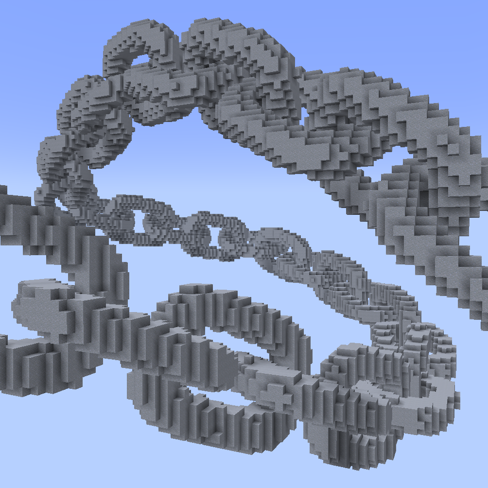

`//ezsp 3d `<mark style="color:orange;">`Chainlink(M:99,N:99,Extrusion:0.6)`</mark>` clay 10`

* `M:99` 負責讓鏈條看起來是矩形（而非橢圓形）。
* `N:99` 負責讓方形鏈結的橫截面呈現方形。

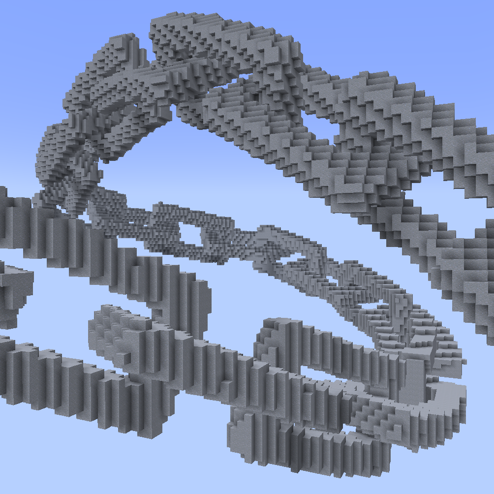

`//ezsp 3d `<mark style="color:orange;">`Chainlink(M:1,N:1,E:0.7,G:-0.2,T:1.2)`</mark>` clay 11`

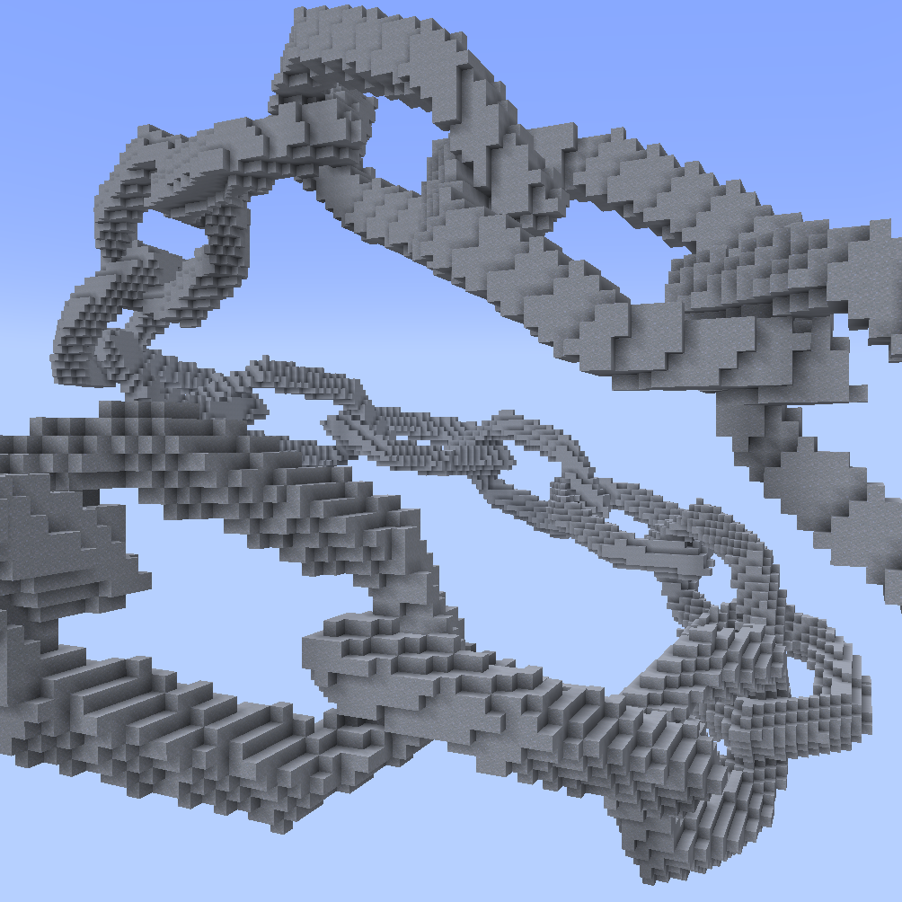

`//ezsp 3d `<mark style="color:orange;">`Chainlink(M:2,N:2,E:0,G:1)`</mark>` clay 11`

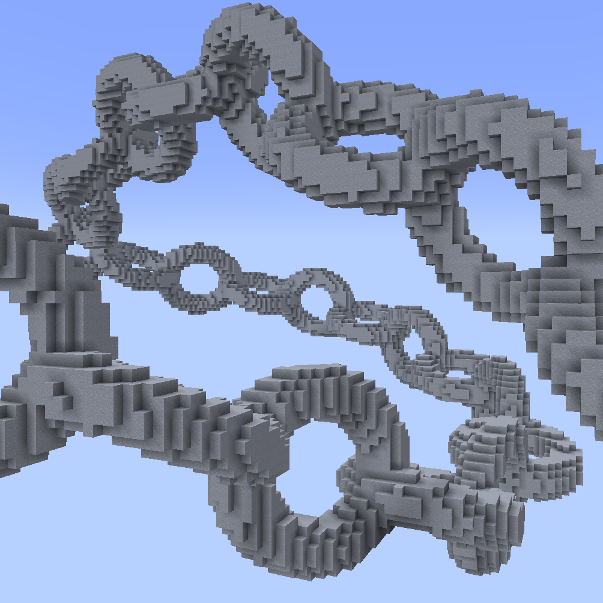

`//ezspline 3d `<mark style="color:orange;">`Chainlink(P:FIRST)`</mark> <mark style="color:red;">`red_terracotta`</mark>` 10`

`//ezspline 3d `<mark style="color:orange;">`Chainlink(P:SECOND)`</mark> <mark style="color:blue;">`blue_wool`</mark>` 10`

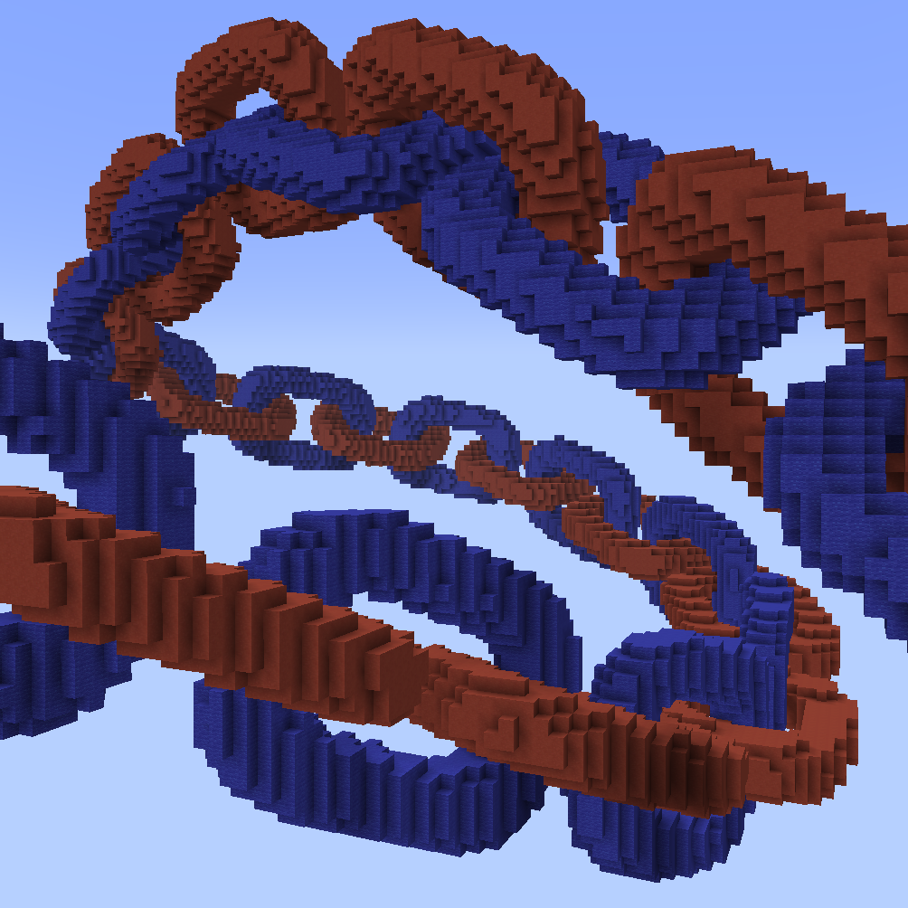

***

#### 

### `//ezspline 3d `<mark style="color:orange;">`Fishnet (Fi)`</mark> 

<mark style="color:blue;">Fishnet Spline</mark>

**`//ezsp 3d Fishnet([`**<mark style="color:orange;">**`Spacing:<value>`**</mark>**`],[`**<mark style="color:orange;">**`Depth:<value>`**</mark>**`],[`**<mark style="color:orange;">**`Width:<value>`**</mark>**`])`** [**`<pattern>`**](3d-spline-shapes.md#syntax) [**`<radii>`**](common-parameters.md#radii) [**`[-s <stretch>]`**](common-parameters.md#stretch-s-less-than-stretchfactor-greater-than) [**`[-t <angle>]`**](common-parameters.md#twist) [**`[-p <kbParameters>]`**](common-parameters.md#kb-parameters) [**`[-q <quality>]`**](common-parameters.md#quality) [**`[-n <normalMode>]`**](common-parameters.md#normal-mode) [**`[-h]`**](common-parameters.md#help-page)

沿著選定的位置產生一個魚網狀樣條曲線。

* **`[`**<mark style="color:orange;">**`Spacing:<value>`**</mark>**`]`** (<mark style="color:orange;">**`S`**</mark>)（預設值：1.0）：
  * 網格繩索間的距離。
* **`[`**<mark style="color:orange;">**`Depth:<value>`**</mark>**`]`** (<mark style="color:orange;">**`D`**</mark>)（預設值：0.2）：
  * 每條繩索的深度，表示它向樣條中心突出多少。
* **`[`**<mark style="color:orange;">**`Width:<value>`**</mark>**`]`** (<mark style="color:orange;">**`W`**</mark>)（預設值：0.2）：
  * 每條繩索的寬度。

(<mark style="color:blue;">**`!`**</mark>) 我們提供一個互動式 3D 圖，可以自由調整所有參數（非常方便）：[https://www.desmos.com/3d/eww8fzzyuj](https://www.desmos.com/3d/eww8fzzyuj)

**範例：**

`//ezspline 3d `<mark style="color:orange;">`Fishnet`</mark>` clay 10`

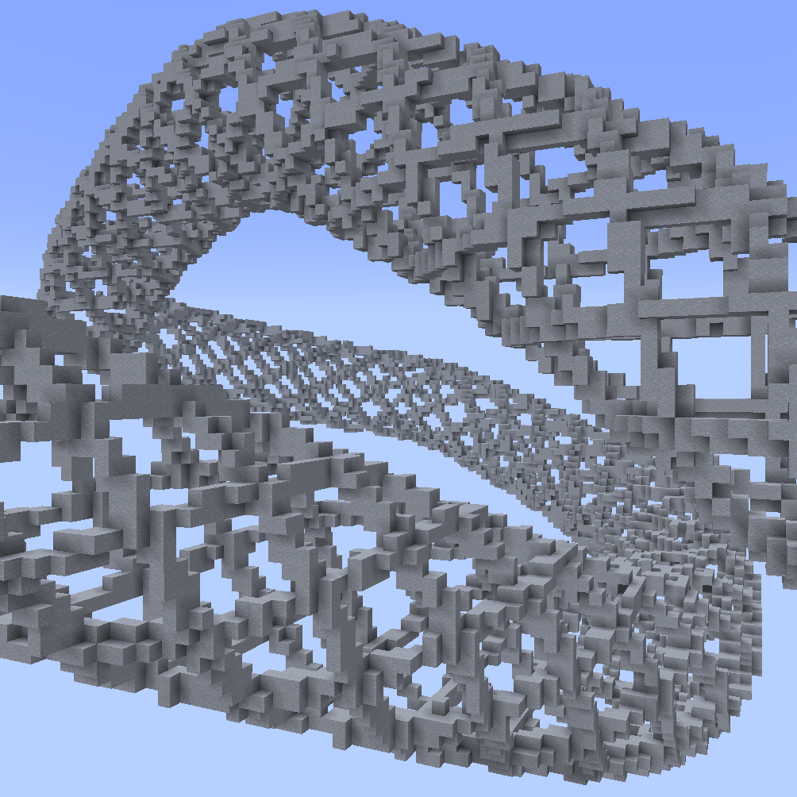

`//ezsp 3d `<mark style="color:orange;">`Fishnet(Spacing:2.0)`</mark>` clay 10`

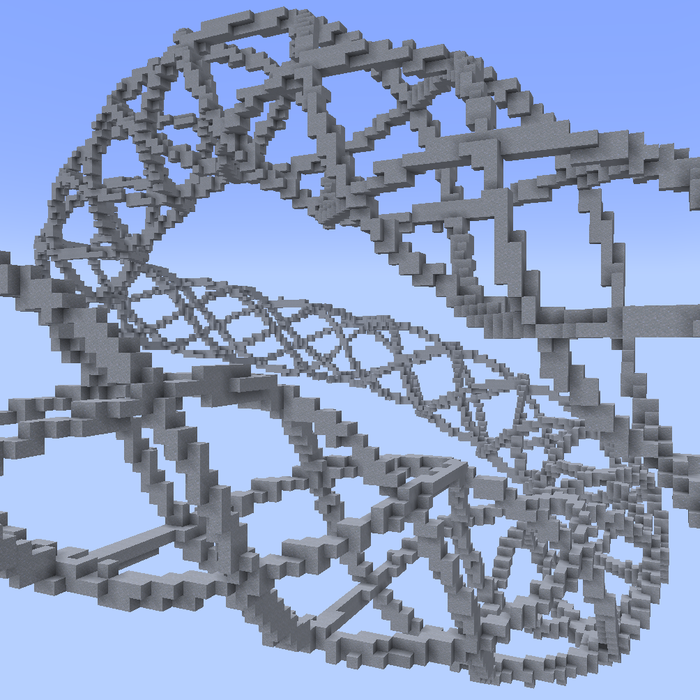

`//ezsp 3d `<mark style="color:orange;">`Fishnet(S:2.0,Depth:1.0,Width:0.3)`</mark>` clay 10`

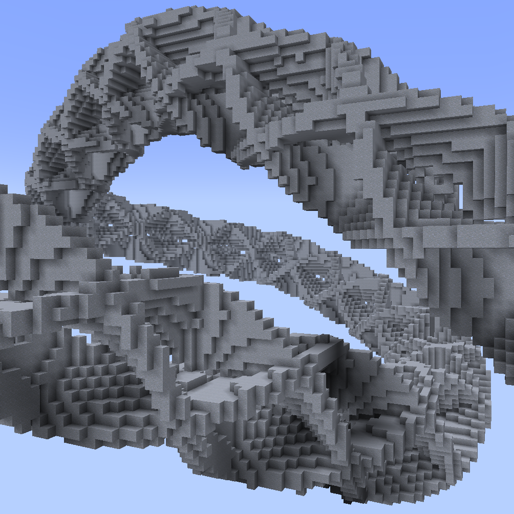

`//ezsp 3d `<mark style="color:orange;">`Fi(S:2.0,D:0.5,W:0.5)`</mark>` clay 10`

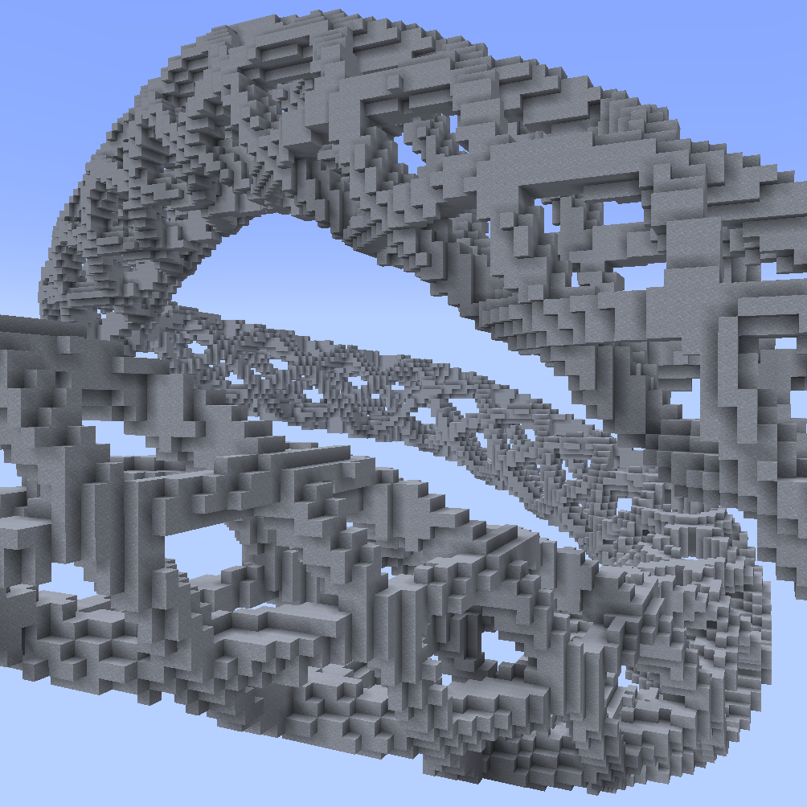

***

#### 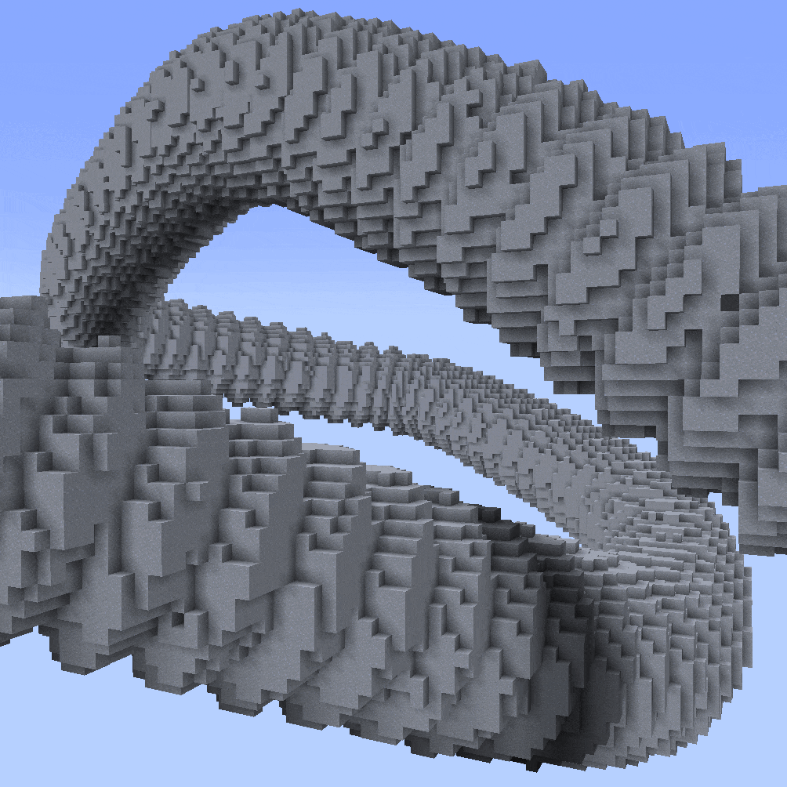

### `//ezspline 3d `<mark style="color:orange;">`Oscillate (Os)`</mark> 

<mark style="color:blue;">Oscillation Spline</mark>

**`//ezsp 3d Oscillate([`**<mark style="color:orange;">**`Depth:<value>`**</mark>**`],[`**<mark style="color:orange;">**`Interval:<value>`**</mark>**`])`** [**`<pattern>`**](3d-spline-shapes.md#syntax) [**`<radii>`**](common-parameters.md#radii)[**`[-s <stretch>]`**](common-parameters.md#stretch-s-less-than-stretchfactor-greater-than) [**`[-t <angle>]`**](common-parameters.md#twist) [**`[-p <kbParameters>]`**](common-parameters.md#kb-parameters) [**`[-q <quality>]`**](common-parameters.md#quality) [**`[-n <normalMode>]`**](common-parameters.md#normal-mode) [**`[-h]`**](common-parameters.md#help-page)

沿著選定的位置產生一個厚度會擺動的樣條曲線。

* **`[`**<mark style="color:orange;">**`Depth:<value>`**</mark>**`]`** (<mark style="color:orange;">**`D`**</mark>)（預設值：0.2）：
  * 指定山脊切入樣條表面的深度（以方塊數計）。
* **`[`**<mark style="color:orange;">**`Interval:<value>`**</mark>**`]`** (<mark style="color:orange;">**`I`**</mark>)（預設值：0.5）：
  * 指定每個山脊之間的距離。

(<mark style="color:blue;">**`!`**</mark>) 我們提供一個互動式 3D 圖，可以自由調整所有參數：[https://www.desmos.com/3d/xilpdwcnom](https://www.desmos.com/3d/xilpdwcnom)

範例：

`//ezspline 3d `<mark style="color:orange;">`Oscillate`</mark>` clay 10`

使用預設值 <mark style="color:orange;">`Depth:0.2`</mark> 和 <mark style="color:orange;">`Interval:0.5`</mark>

`//ezsp 3d `<mark style="color:orange;">`Oscillate(Depth:0.6)`</mark>` clay 10`

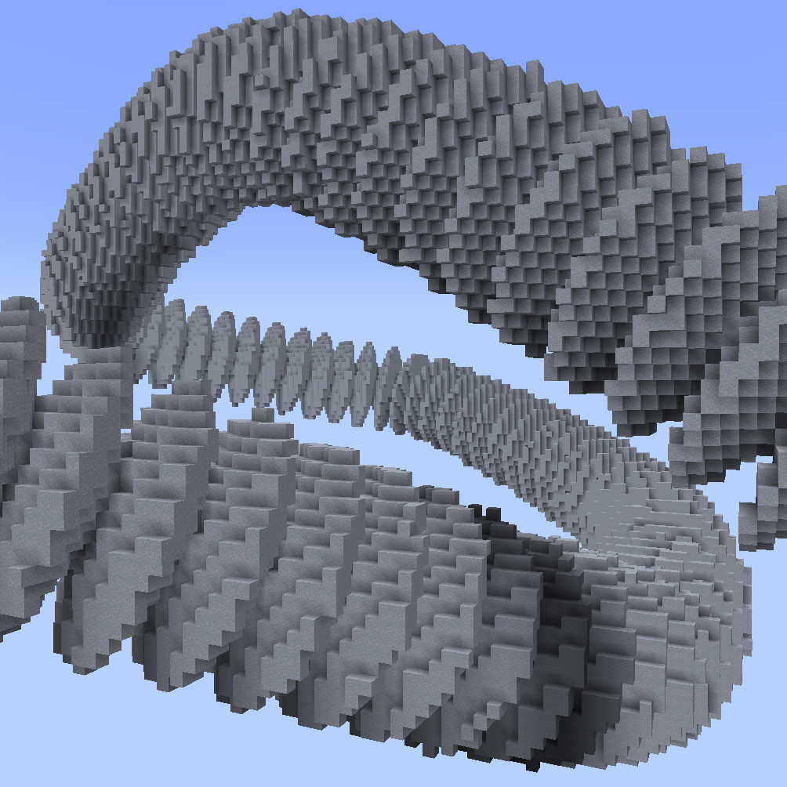

`//ezsp 3d `<mark style="color:orange;">`Oscillate(Depth:0.6,Interval:1.5)`</mark>` clay 10`

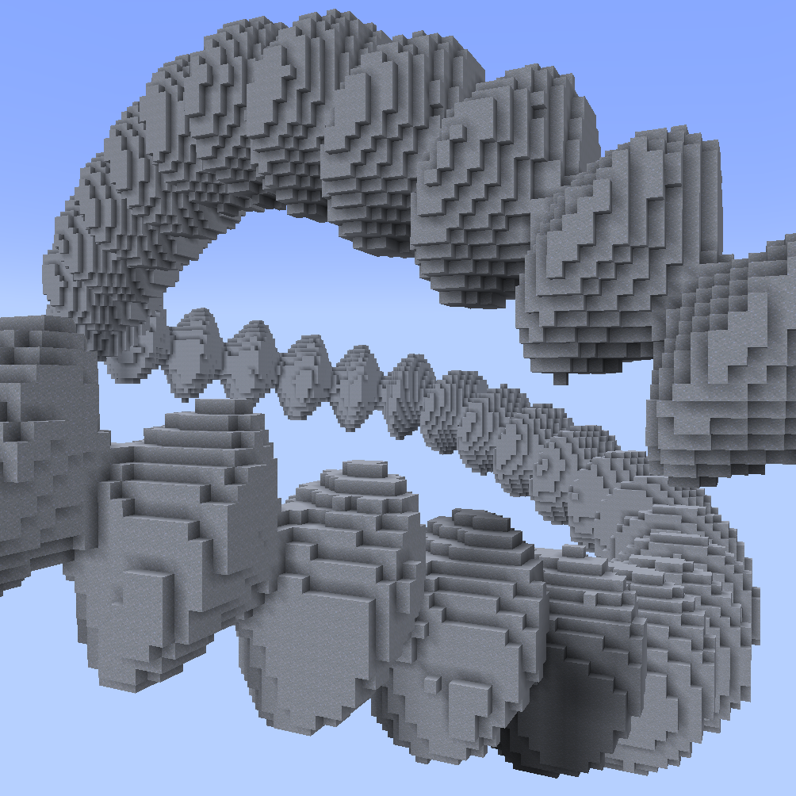

`//ezsp 3d `<mark style="color:orange;">`Oscillate(Depth:0.2,Interval:1.5)`</mark>` clay 10`

可以簡寫成 <mark style="color:orange;">`Os(D:0.2,I:1.5)`</mark>

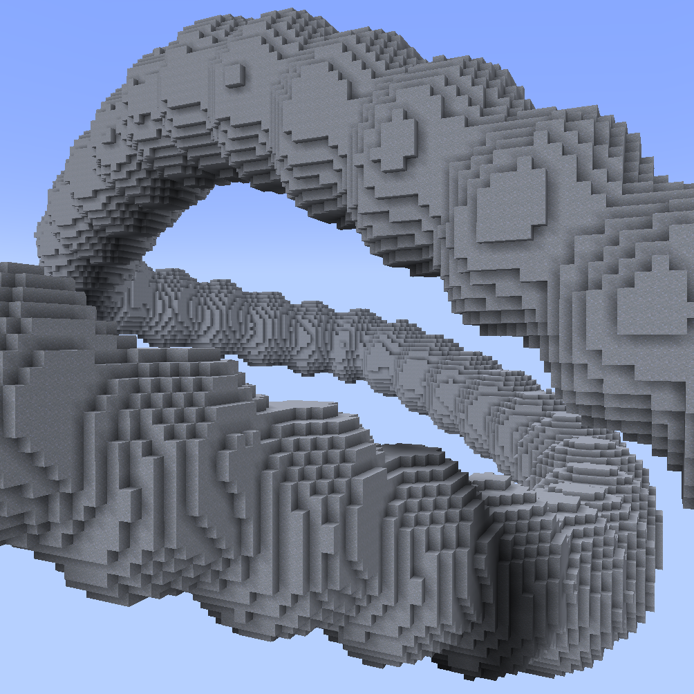

***

#### 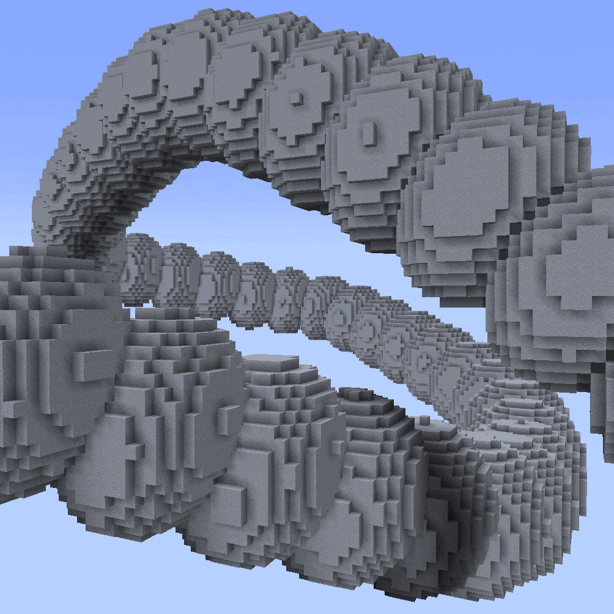

### `//ezspline 3d `<mark style="color:orange;">`Rings (Ri)`</mark> 

<mark style="color:blue;">Rings Spline</mark>

