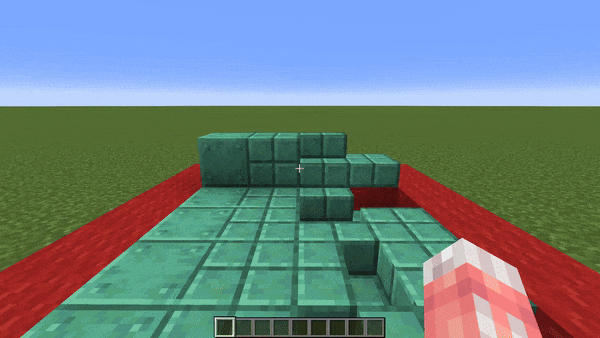
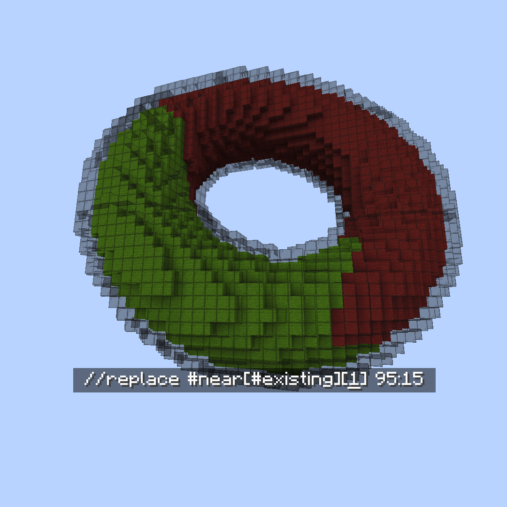
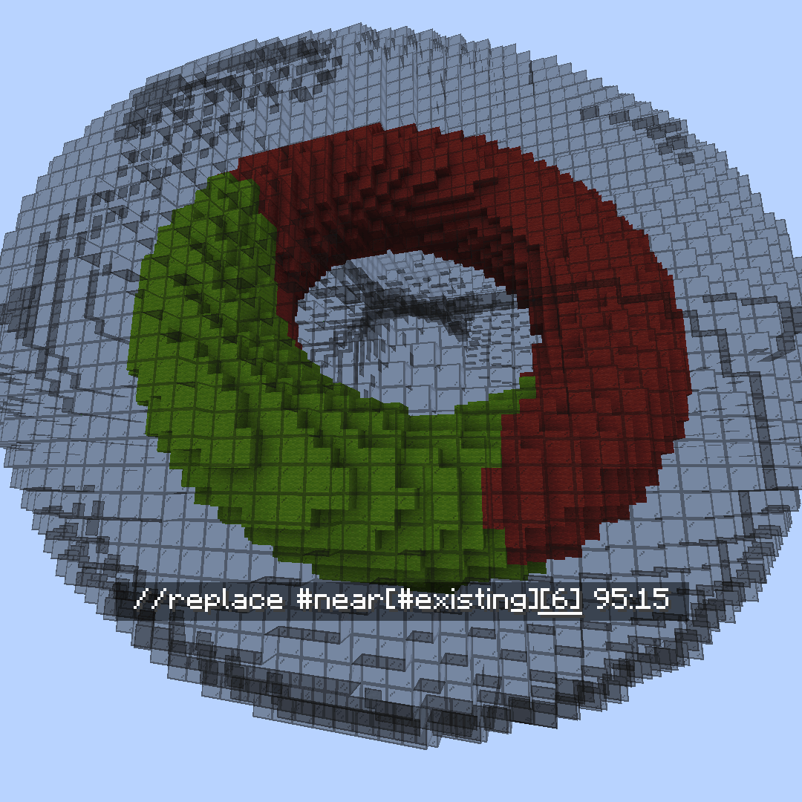

<!--
CO_OP_TRANSLATOR_METADATA:
{
  "original_hash": "781c8dc997b4559295db4013c7def0dc",
  "translation_date": "2025-05-13T02:26:15+00:00",
  "source_file": "masks-and-patterns/masks.md",
  "language_code": "tw"
}
-->
# Masks

### `#aim`

#aim Mask

**`#aim` 或 `#aim[True|False]`**

以玩家瞄準的方塊作為遮罩。

可選擇傳入 True/False 設定，讓你的瞄準對命中箱有反應。

* False 會把所有方塊當作完整方塊。例如，你無法 `#aim` 在按鈕後方的方塊。
* True 會尊重你所看的方塊的命中箱。例如，你可以 `#aim` 在臺階後方的方塊。

### `#attached`

#attached mask

**`#attached[<vector,vector,vector ...>]`**

遮罩至至少附著於一個相鄰非空氣方塊的方塊。

可選擇傳入一組方向向量列表來檢查，而非檢查所有面。\
例如 `#attached[up,down,left,north]`

\
無論哪種情況，附著的意思是該方塊「接觸」到相鄰方塊。 所以底部臺階不會通過 `#attached[up]`，而帶有狀態 `[hanging=true]` 的燈籠會通過。

### `#blocklight`

#blocklight Mask

**`#blocklight[lightLevel]` 或 `#blocklight[minLevel][maxLevel]`**

遮罩至特定方塊光亮度的方塊（由除天空光以外的光源提供的照明）。可選擇傳入最小和最大光亮度，匹配該範圍內的任何光度。

### `#current`

#current mask

簡寫：**`#c`**

代表你目前全域遮罩（gmask）的遮罩。

例如執行 `//gmask !#current` 會反轉你目前的 gmask。

### `#eznoise`

#eznoise Mask

**`#eznoisemask[noisePreset][<scale>][<threshold>][<seed>]`**\
**別名：`#eznm`**

使用噪聲預設值 `0.0-1.0`，匹配超過指定噪聲閾值的方塊。

### `#fullblock`

#fullblock mask

遮罩至填滿整個立方體空間的方塊。

例如 1-7 層雪不會通過，但 8 層雪、像石頭這樣的方塊，或像玻璃這樣的透明方塊會通過。

### `#fuzzypalette`

#fuzzypalette mask

**`#fuzzypalette[palette]`**

簡寫：**`#fpalette`**

遮罩至與調色盤中任一方塊匹配的方塊，無視方塊數據。\
等同於 **`#palette[palette][False]`**

### `#infested`

#infested mask

遮罩至被銀魚寄生的方塊。

### `#lightsource`

#lightsource Mask

**`#lightsource` 或 `#lightsource[lightLevel]` 或 `#lightsource[minLevel][maxLevel]`**

遮罩至會發光的方塊。可選擇傳入特定光度，或最小與最大光度，匹配該範圍內的任何光度。

### `#near`

#near Mask

**`#near[mask][distance]`**\
&#xNAN;**`#near[mask][minDistance][maxDistance]`**\
\
遮罩至距離某遮罩在球面（歐氏距離）範圍內的所有方塊。\
不會修改匹配內部 `mask` 的方塊。\
也可設定排除比最小距離更近的方塊。\\

 **`[mask]`**

 **`[distance]`**

 **`[minDistance][maxDistance]`**

### `#palette`

#palette mask

**`#palette[palette][<strict>]`**

遮罩至與調色盤中任一方塊匹配的方塊。

可選傳入 `<strict>`，值為 True 或 False，決定是否也要匹配方塊數據。\
例如 `oak_stairs[facing=east]` 只有在 strict 設為 **False** 時，才會和 `oak_stairs[facing=west]` 匹配。

### `#truelight`

#truelight Mask

**`#truelight[lightLevel]` 或 `#truelight[minLevel][maxLevel]`**

遮罩至特定總光亮度的方塊（由任何光源包括天空光提供的照明）。可選擇傳入最小和最大光亮度，匹配該範圍內的任何光度。

### `#vectorgradient`

#vectorgradient Mask

**`#vectorgradientmask[vector][distance][<noisePreset>][<noiseScale>][noiseSeed]`**

簡寫：`#vgradientm`

沿著向量遮罩方塊，距離越近的方塊越有可能通過遮罩檢查。\
相容於噪聲預設。

**免責聲明**：  
本文件係使用 AI 翻譯服務 [Co-op Translator](https://github.com/Azure/co-op-translator) 進行翻譯。雖然我們致力於翻譯的準確性，但請注意自動翻譯可能包含錯誤或不準確之處。原始文件之母語版本應視為權威依據。對於重要資訊，建議採用專業人工翻譯。我們不對因使用本翻譯而產生之任何誤解或誤譯負責。