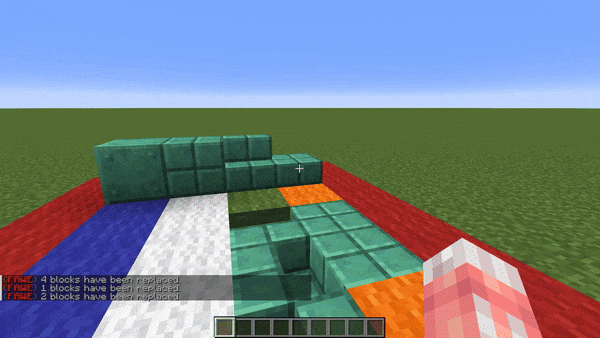

<!--
CO_OP_TRANSLATOR_METADATA:
{
  "original_hash": "ffb691b9e652476d707559f668396083",
  "translation_date": "2025-05-13T02:26:38+00:00",
  "source_file": "masks-and-patterns/patterns.md",
  "language_code": "tw"
}
-->
# Patterns

### `#aim`

#aim Pattern

**`#aim` or `#aim[True|False]`**

會以玩家瞄準的方塊作為 Pattern。

可以選擇設定 True/False 來決定是否對準碰撞箱。

- False 會把所有方塊當作完整方塊。例如你無法 `#aim` 在按鈕後面的方塊。
- True 會依照你看的方塊碰撞箱判定。例如你可以 `#aim` 在階梯後面的方塊。

### `#eznoise`

#eznoise Pattern

**`#eznoisepattern[palette][noisePreset][<scale>][<seed>]`**\
**別名: `#eznp`**

使用噪音預設值來回傳調色盤方塊。\
**內建以下預設：**

* **`#ridged[palette][<scale>][<seed>]`**
* **`#smoothcells[palette][<scale>][<seed>]`** 
* **`#voronoiedge[palette][<scale>][<seed>]`**

### `#palette`

#palette Pattern

**`#palette[palette]`**

使用指定的調色盤並回傳調色盤方塊清單。\
可以用來當作隨機方塊的 Pattern。

例如 `//set #palette[##ice]` 跟 `//set [blue_ice,packed_ice,ice]` 是一樣的。

### `#selection`

#selection Pattern

**`#selection[selection][<offset>]`**

簡寫：**`#sel[selection][<offset>]`**

使用目前世界中已儲存選取區位置的方塊來設定。\
就像是選取區被平鋪/堆疊一樣。

可選擇使用 `<offset>` 變數以指定向量偏移 Pattern。

### `#vectorgradient`

#vectorgradient Pattern

**`#vectorgradientpattern[palette][vector][distance][<noisePreset>][<noiseScale>][<noiseSeed>]`**\
**別名: `#vgradientp`**

沿著向量設定調色盤方塊，距離長度為指定值，方塊選擇依距離加上混合因子決定。也可使用噪音預設。

**免責聲明**：  
本文件係使用 AI 翻譯服務 [Co-op Translator](https://github.com/Azure/co-op-translator) 進行翻譯。雖然我們致力於確保翻譯的準確性，但請注意，自動翻譯可能包含錯誤或不準確之處。原始文件之母語版本應視為權威來源。對於重要資訊，建議採用專業人工翻譯。我們不對因使用本翻譯所導致之任何誤解或誤譯負責。