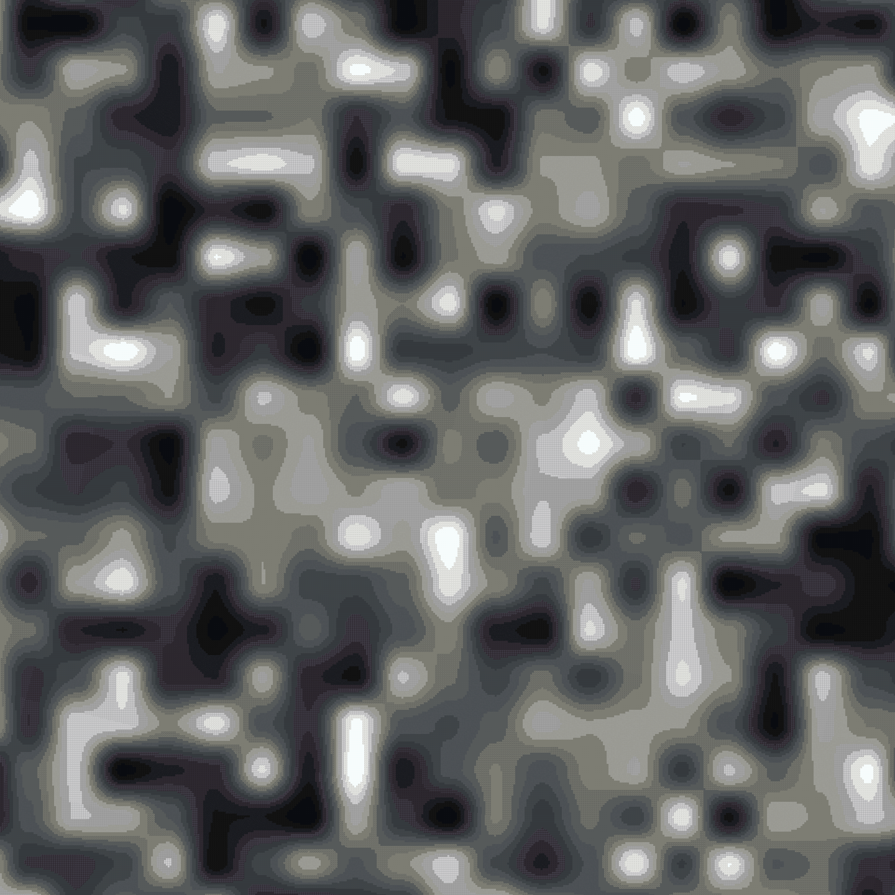
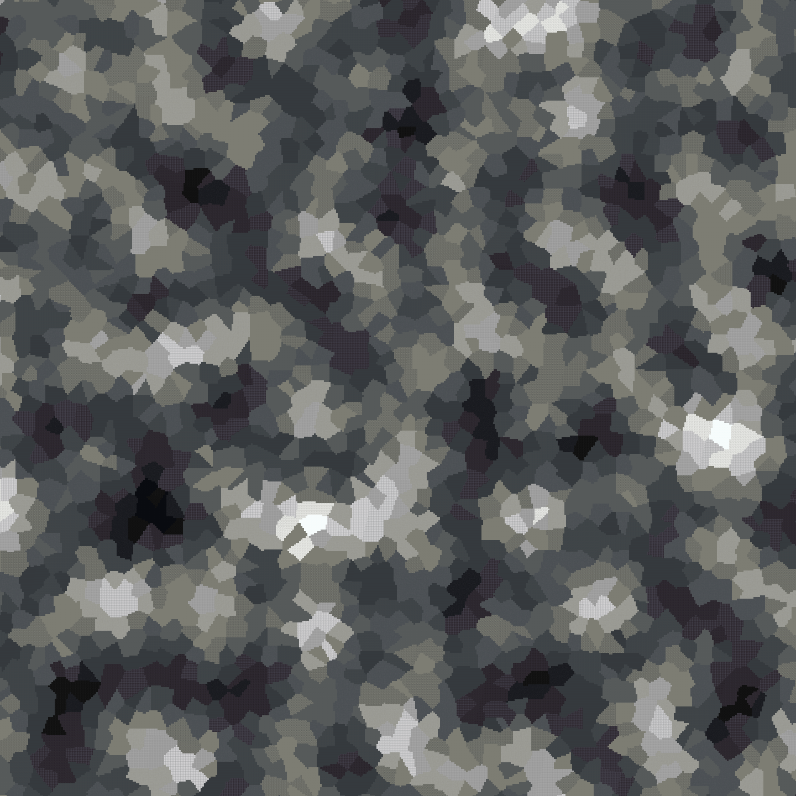

<!--
CO_OP_TRANSLATOR_METADATA:
{
  "original_hash": "1f8892dbba860a94ce6e8bdd1c75d358",
  "translation_date": "2025-05-13T02:27:00+00:00",
  "source_file": "noise/noise-explained.md",
  "language_code": "tw"
}
-->
# 噪音說明

噪音對於從未接觸過的人來說可能是個複雜的主題，但簡單來說，噪音就是從某些輸入（通常是 X、Y、Z 座標）中取得一個數值的方法。

你最熟悉噪音的地方很可能是 Minecraft 的地形生成。在世界的每個點上，會將多個噪音函數結合起來判斷是否放置方塊，以及放哪種方塊。

這基本上就是我們在 ezEdits 裡所做的，利用噪音來生成形狀、地形和材質。

在外掛裡你會找到幾種不同的噪音類型，每種都有不同特性，而 Cellular 類型特別有許多可自訂的參數。

使用噪音的功能包括：

* `//eznoisegen ...` - *Noisegen 指令*
* `#eznoisemask` - *遮罩*
* `//ezbrush gradient ...` - *畫筆*

_ezEdits 的噪音基於修改版的 FastNoiseLite，我們強烈建議你到這個網站試玩噪音參數：_ [_http://auburn.github.io/FastNoiseLite/_ ](http://auburn.github.io/FastNoiseLite/)

## 噪音參數

每個參數和許多數值都有簡寫，例如用 "Fractal" 代表 "FractalType"，或用 "Simplex" 代表 "OpenSimplex2"。只要可能，簡寫會用括號標示。\
<mark style="color:red;">`Red = Parameter`</mark>    <mark style="color:purple;">`Purple = Value`</mark>

 

### 噪音類型

設定噪音類型 <mark style="color:red;">

設定要使用的噪音類型。這是任何噪音的起點，格式會是 `Noise()`，例如 `Perlin()`，其他參數會放在括號中。

* <mark style="color:purple;">`Perlin (per)`</mark>
* <mark style="color:purple;">`OpenSimplex2 (simplex)`</mark>
* <mark style="color:purple;">`OpenSimplex2S (smooth)`</mark>
* <mark style="color:purple;">`Value (val)`</mark>
* <mark style="color:purple;">`ValueCubic (cubic)`</mark>
* <mark style="color:purple;">`White`</mark>
* <mark style="color:purple;">`Cellular (vor)`</mark>
* <mark style="color:purple;">`Shard`</mark>

### 基本噪音參數

基本噪音參數

* <mark style="color:red;">`Seed`</mark>\
  設定噪音的種子值。輸入 -1 或不填則會隨機產生種子。
* <mark style="color:red;">`Frequency (Freq)`</mark>\
  設定噪音的頻率。頻率越高噪音起伏越大，頻率越低則越平滑。
* <mark style="color:red;">`Inverted (Invert)`</mark>\
  是否反轉噪音數值，預設為 false。
  * <mark style="color:purple;">`True`</mark>
  * <mark style="color:purple;">`False`</mark>
* <mark style="color:red;">`ValueMapping (Map)`</mark>\
  是否忽略或覆寫數值映射。預設噪音會映射到 0 到 1 之間。
  * <mark style="color:purple;">`Default (Def)`</mark>
  * <mark style="color:purple;">`None (No)`</mark>
  * <mark style="color:purple;">`Override (OR)`</mark>\
    **如果覆寫：**
    * <mark style="color:red;">`LowerBound (Min)`</mark>
    * <mark style="color:red;">`UpperBound (Max)`</mark>
* <mark style="color:red;">`XScaling (X)`</mark>\
  可用來拉伸或壓縮 X 軸。
* <mark style="color:red;">`YScaling (Y)`</mark>\
  使用 3D 噪音時，可用來拉伸或壓縮 Y 軸。
* <mark style="color:red;">`ZScaling (Z)`</mark>\
  可用來拉伸或壓縮 Z 軸。

### Cellular 噪音參數

<strong>額外 Cellular 噪音參數</strong>

* <mark style="color:red;">`CellularJitterModifier (Jitter)`</mark>\
  通常是 `0..1.0`\
  控制 cellular 噪音節點的隨機抖動或分佈，0 是完美格子，1 是最大隨機但不重疊。超過 1 的值會開始與鄰近節點重疊。
* <mark style="color:red;">`CellularDistanceFunction (Distance)`</mark>\
  控制計算每個點到節點距離的數學方法。
  * <mark style="color:purple;">`Euclidean`</mark>
  * <mark style="color:purple;">`EuclideanSq (sq)`</mark>
  * <mark style="color:purple;">`Manhattan (man)`</mark>
  * <mark style="color:purple;">`Hybrid`</mark>
  * <mark style="color:purple;">`Minkovski1 (m1)`</mark>
  * <mark style="color:purple;">`Minkowvki4 (m4)`</mark>
  * <mark style="color:purple;">`Minkowski99 (m99)`</mark>
  * <mark style="color:purple;">`Rounded (round)`</mark>
* <mark style="color:red;">`CellularReturnType (DistReturn)`</mark>\
  控制距離值在回傳前的修改方式。\
  所有 Distance2\* 類型指的是第二近的節點距離，而非最近的。
  * <mark style="color:purple;">`CellValue (cell)`</mark>
  * <mark style="color:purple;">`Distance (1)`</mark>
  * <mark style="color:purple;">`DistanceSquared (sq)`</mark>
  * <mark style="color:purple;">`DistanceInverse (inv)`</mark>
  * <mark style="color:purple;">`DistanceLog (log)`</mark>
  * <mark style="color:purple;">`DistanceExp (exp)`</mark>
  * <mark style="color:purple;">`Distance2 (2)`</mark>
  * <mark style="color:purple;">`Distance2Add (2add)`</mark>
  * <mark style="color:purple;">`Distance2Add (2sub)`</mark>
  * <mark style="color:purple;">`Distance2Add (2mul)`</mark>
  * <mark style="color:purple;">`Distance2Add (2div)`</mark>
  * <mark style="color:purple;">`Distance2Sq (2sq)`</mark>
  * <mark style="color:purple;">`Distance2Inv (2inv)`</mark>
  * <mark style="color:purple;">`Distance2Log (2log)`</mark>
  * <mark style="color:purple;">`Distance2Exp (2exp)`</mark>
  * <mark style="color:purple;">`Edge`</mark>
  * <mark style="color:purple;">`Rounded (round)`</mark>
  * <mark style="color:purple;">`NoiseLookup (noise)`</mark>\
    **額外噪音查詢參數：**
    * <mark style="color:red;">`CellularNoiseLookup (Lookup)`</mark>\
      使用 NoiseLookup 回傳類型時，控制要疊加在 cellular 噪音上的底層噪音。
      * <mark style="color:purple;">`Perlin (per)`</mark>
      * <mark style="color:purple;">`OpenSimplex2 (simplex)`</mark>
      * <mark style="color:purple;">`OpenSimplex2S (smooth)`</mark>
      * <mark style="color:purple;">`Value (val)`</mark>
      * <mark style="color:purple;">`ValueCubic (cubic)`</mark>
      * <mark style="color:purple;">`White`</mark>
      * <mark style="color:purple;">`Cellular (vor)`</mark>
    * <mark style="color:red;">`CellularNoiseLookupFrequency (DistReturn)`</mark>\
      控制底層噪音的頻率。

### Shard 噪音參數

額外 Shard 噪音參數

* <mark style="color:red;">`Sharpness (Sharp)`</mark>\
  通常是 `0..1.0`\
  控制 Shard 噪音的圖案銳利度。數值越高圖案邊緣越明顯，數值越低則越模糊。

### Fractal 噪音參數

Fractal 噪音參數

* <mark style="color:red;">`FractalType (Fractal)`</mark>\
  設定要使用的分形噪音類型。
  * <mark style="color:purple;">`None (No)`</mark>
  * <mark style="color:purple;">`FBm`</mark>
  * <mark style="color:purple;">`Ridged`</mark>
  * <mark style="color:purple;">`PingPong (PP)`</mark>\
    **額外 PingPong 分形參數：**
    * <mark style="color:red;">`PingPongStrength (PPStr)`</mark>

**如果選擇的分形類型不是 `None`：**

* <mark style="color:red;">`Octaves (Oct)`</mark>\
  設定分形噪音的層數。
* <mark style="color:red;">`Lacunarity (Lac)`</mark>\
  設定每層分形的縮放比例。數值大於 1 會增加頻率，數值小於 1 會降低頻率。
* <mark style="color:red;">`Gain`</mark>\
  設定每層分形的相對強度。數值小於 1 會逐層減弱，數值大於 1 會逐層增強。
* <mark style="color:red;">`WeightedStrength (Weighted)`</mark>\
  設定每層強度對噪音數值的響應度。

### Domain Warp 參數

Domain Warp 參數

* <mark style="color:red;">`DomainWarpType (Warp)`</mark>\
  設定要使用的域變形類型。
  * <mark style="color:purple;">`None (No)`</mark>
  * <mark style="color:purple;">`BasicGrid (Grid)`</mark>
  * <mark style="color:purple;">`OpenSimplex2 (Simplex)`</mark>
  * <mark style="color:purple;">`OpenSimplex2Reduced (Reduced)`</mark>
  * <mark style="color:purple;">`Flow`</mark>
  * <mark style="color:purple;">`Turbulence (Turb)`</mark>

**如果選擇的域變形類型不是 `None`：**

* <mark style="color:red;">`DomainWarpFreq (WarpFreq)`</mark>\
  設定域變形的頻率。
* <mark style="color:red;">`DomainWarpOct (WarpOct)`</mark>\
  設定域變形的層數。
* <mark style="color:red;">`DomainWarpGain (WarpGain)`</mark>\
  設定每層域變形的相對強度。
* <mark style="color:red;">`DomainWarpAmp (WarpAmp)`</mark>\
  設定域變形的整體振幅（強度）。
* <mark style="color:red;">`DomainWarpFrac (WarpFrac)`</mark>\
  設定域變形專用的分形類型。
  * <mark style="color:purple;">`None (No)`</mark>
  * <mark style="color:purple;">`DomainWarpIndependent (ind)`</mark>
  * <mark style="color:purple;">`DomainWarpProgressive (prog)`</mark>
* <mark style="color:red;">`DomainWarpLacunarity (WarpLac)`</mark>\
  設定每層域變形的縮放比例。

## 範例

**`Value(Seed:123,Freq:0.04)`**

<figure><figcaption></figcaption></figure>

**`Cellular(Distance:Euclidean,DistReturn:NoiseLookup,Lookup:Perlin,LookupFreq:0.2,Freq:0.1)`**

<figure><figcaption></figcaption></figure>

**免責聲明**：  
本文件係使用 AI 翻譯服務 [Co-op Translator](https://github.com/Azure/co-op-translator) 進行翻譯。雖然我們致力於翻譯的準確性，但請注意，自動翻譯可能會包含錯誤或不準確之處。原始文件的母語版本應視為權威來源。對於重要資訊，建議使用專業人工翻譯。我們不對因使用本翻譯而產生的任何誤解或誤釋負責。